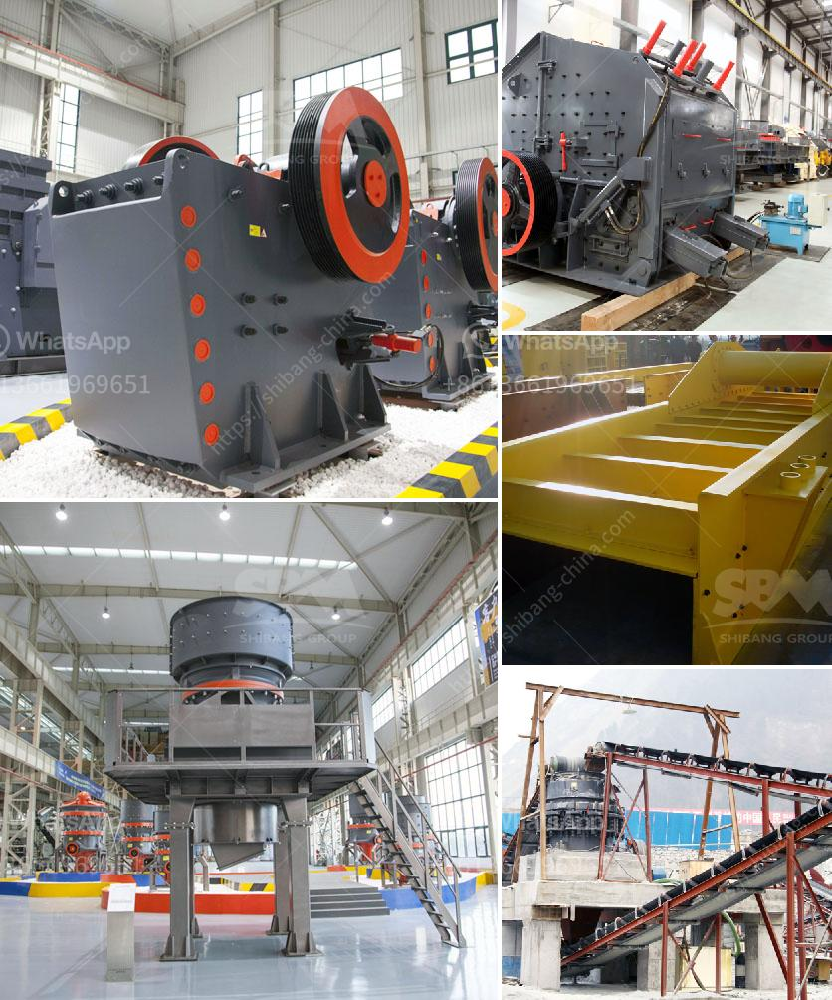

<h3>used stone crusher plant for sale in china</h3>
Used stone crusher plant for sale in China has been widely showcased in the market. To purchase such a plant, you need to have a good understanding about the types of plants available, and their features. This will help you identify the plant that is most suitable for your needs, and maximize your return on investment.

There are many different types of stone crusher plants operating in various states with a production capacity ranging from 3 to 25 TPH. Generally, the smaller the stone crusher plant, the less production capacity will be required. In these plants, it is important to invest in a stone crusher plant for sale that has a high return on investment. This will help you save a significant amount of money in the long run.

Some of the popular choices for buyers searching for used stone crushers in China include the PE series jaw crushers, PF series impact crushers, PY series cone crushers, and the HJ series jaw crushers. The stone crusher market in China is expected to grow at a CAGR of around 7% during the forecast period, driven by the increased construction activities in the country.

The used stone crusher plant for sale available in various capacities (ranging from 30 tph to 200 tph) enables customers to choose the most suitable model according to their needs and budget. In addition to the stone crusher plant, you can also choose portable crushers or stationary crushers.

No matter which type of machine you choose, you should be prepared for some very powerful crushing capabilities. Many of the stone crusher machines in China are large, heavy-duty equipment that can crush rock and stone into small, manageable pieces. High-output crushers enable you to achieve maximum efficiency within your budget, making them a practical option for many businesses.

In conclusion, if you’re looking for a stone crusher plant for sale in China, you have a wide range of choices. The key is to choose the right plant for your needs, and to ensure that the machine’s features and specifications match your requirements. By doing so, you will maximize the return on investment of your purchase and achieve long-term success.
<h3>Contact us</h3><ul><li><strong>Whatsapp:&nbsp;<a href="https://wa.me/8613661969651">+8613661969651</a></strong></li><li><a href="https://swt.shibang-china.com/?git&amp;zhl&amp;used stone crusher plant for sale in china"><strong>Online Service(chat now)</strong></a></li></ul><h3>Related</h3><ul><li><a href='price of conveyor belts.md'>price of conveyor belts</a></li><li><a href='cost of setting up a quarry crusher in nigeria.md'>cost of setting up a quarry crusher in nigeria</a></li><li><a href='quarry stone crushing machine manufacturers.md'>quarry stone crushing machine manufacturers</a></li><li><a href='to buy gypsum calcination rotary kiln plant.md'>to buy gypsum calcination rotary kiln plant</a></li><li><a href='ton hour coal crusher and screen.md'>ton hour coal crusher and screen</a></li></ul>