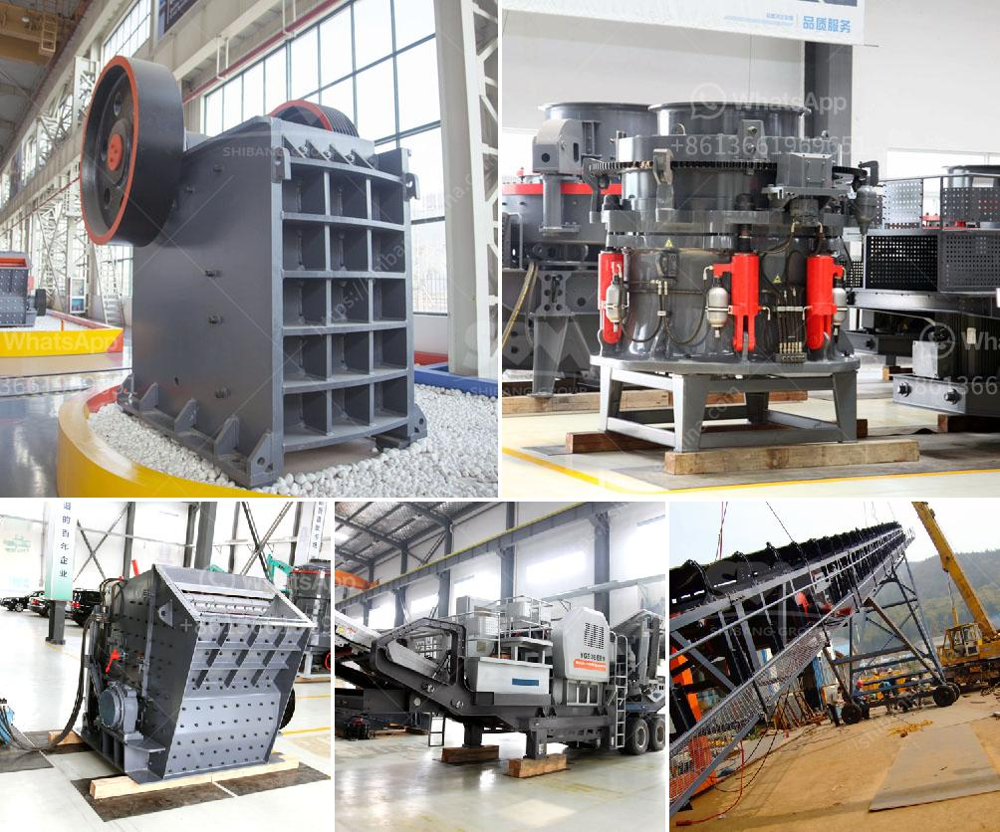

<h3>used stone crushers for sale south africa</h3>
Stone crushers are widely used in various materials processing in the mining and construction industries, such as granite, limestone, gravel, basalt, and river pebbles, etc. These materials can be used as raw materials for infrastructure construction and building stone. Generally, stone crushers include jaw crushers, impact crushers, cone crushers, and mobile crushers.

South Africa has abundant mineral resources, especially in recent years with the ongoing infrastructure construction, the demand for stone aggregates is increasing significantly. With the rapid development of mining industry and construction industry, more and more manufacturers are launching new types of stone crushers, which greatly expanding the range of crushing equipment applications.

Used stone crushers for sale in South Africa are mainly used for the primary crushing of ores and rocks. They can be divided into large, medium and small scale mining operations. The main equipment for crushing in South Africa is the crusher, which is used for stone crushing and multi-purpose processing. There are many stone crusher buyers in South Africa who want to buy suitable crushers for their construction projects.

There are many types of stone crushers, which different models, different performances, and different sizes. Therefore, choosing the suitable stone crusher is very important, especially for construction projects. Understanding the specific needs of the project is essential for selecting the right crusher.

For example, if the project is located in a mountainous area and requires frequent transportation, the mobile crusher equipment may be your best choice. On the other hand, if the project is located in a flat area and the materials to be crushed are relatively soft, jaw crushers or impact crushers may be more suitable.

Buying used stone crushers in South Africa is easier than buying new stone crushers, because the used stone crusher price is lower than the new one. But the technical performance of the used stone crushers in South Africa is not so good, so I think that SBM can be a good choice for buying used stone crushers in South Africa. In the selection of SBM stone crushers in South Africa, the user can choose equipment with different types and specifications according to different crushing process requirements.

By utilizing the appropriate crushing method, an impact crusher can produce stone materials with a certain particle size distribution, and even a certain shaping function. Thereby, it can effectively improve the overall performance of the finished product, thereby ensuring the high sales of the project.

In addition, according to the different mobile platforms, mobile crusher plant can also be called tyre mobile crusher and crawler type mobile crusher. Mobile jaw crusher is a small-sized crushing plant composed of jaw crusher and other screening and conveying machines. Mobile cone crusher is a kind of mobile rock crusher, which is mainly used in fine crushing field.

In short, used stone crushers for sale can provide the flexibility and high capacity of stationary crusher at the cost of mobility. From the excavator to the mobile vibration feeder. The aggregate is uniformly put into a mobile jaw crusher for primary crushing. The primary crushed aggregates are fed into a secondary crusher (mobile impact crusher or mobile cone crusher).

Then the finished aggregates are screened by mobile vibrating screen.Finished aggregates of various sizes are transported to the product stack by belt conveyor. And the crushed aggregates larger than the finished aggregates are conveyed into the secondary crusher by a belt conveyor, which crushed aggregates of various specifications are sieved through a vibrating screen, and then transmitted by a belt conveyor to different finished materials stacks.
<h3>Contact us</h3><ul><li><strong>Whatsapp:&nbsp;<a href="https://wa.me/8613661969651">+8613661969651</a></strong></li><li><a href="https://swt.shibang-china.com/?git&amp;zhl&amp;used stone crushers for sale south africa"><strong>Online Service(chat now)</strong></a></li></ul><h3>Related</h3><ul><li><a href='crusher manufacturer in pakistan in lahore.md'>crusher manufacturer in pakistan in lahore</a></li><li><a href='pe 600 900 primary jaw crusher.md'>pe 600 900 primary jaw crusher</a></li><li><a href='stone for stone mill.md'>stone for stone mill</a></li><li><a href='sand crusher machine.md'>sand crusher machine</a></li><li><a href='gravel crusher supplier in the philippines.md'>gravel crusher supplier in the philippines</a></li></ul>