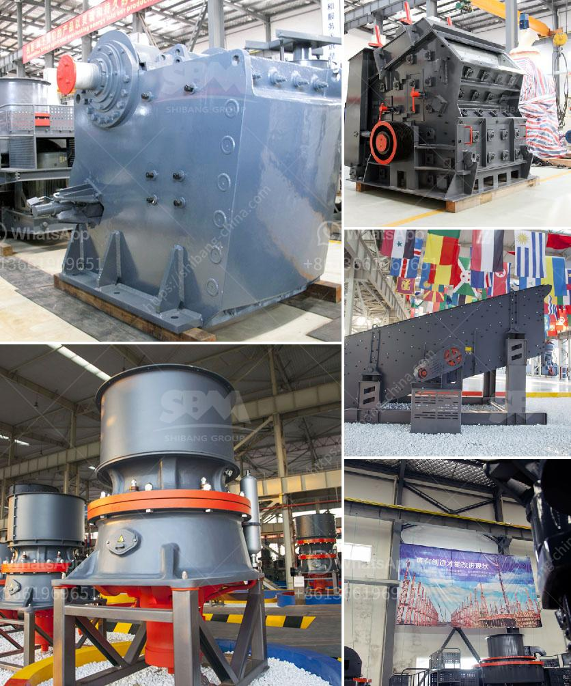

<h3>used stone crushing plant for sale in spain</h3>
Stone crushing plant is an essential machinery in various industries such as mining, construction, and road, railway building. Spaniard manufacturers are making moves to expand internationally and increase their market presence with the recent surge in the export of used stone crushing plants. This article will provide an overview of the current state of the used stone crushing plant market in Spain.

Spain has a rich history of stone quarrying that dates back to Roman times. The country is known for the quality and variety of its natural stone, making it a popular choice for construction projects worldwide. Spanish stone types such as marble, limestone, and granite are highly sought after for their unique colors, patterns, and durability.

In recent years, Spain has faced economic challenges, leading to a decrease in domestic demand for construction materials. This, coupled with the growing popularity of imported stone from countries like India and China, has resulted in a surplus of used stone crushing plants in Spain. As a result, many Spanish companies are now focused on exporting these plants to international markets.

The used stone crushing plant market in Spain is highly competitive due to large numbers of manufacturers who are continuously improving their products to meet the changing needs of the industry. Numerous stone crushing plant manufacturers have emerged in recent years and are actively expanding their presence in international markets.

These manufacturers offer a wide range of used stone crushing plants for sale, including jaw crushers, impact crushers, cone crushers, and other crushing equipment. They carry a variety of brands, including Terex, Powerscreen, Sandvik, Metso, and more.

The used stone crushing plant market in Spain is also benefiting from infrastructure development projects in neighboring countries. The cross-border transportation of construction materials is becoming more efficient, making it easier for Spanish manufacturers to export their products.

One of the key reasons why used stone crushing plants from Spain are highly sought after by international buyers is their affordability. The surplus in the market has led to competitive pricing, making Spanish stone crushing plants a cost-effective solution for construction companies around the world.

Additionally, Spanish manufacturers are known for their commitment to quality. They adhere to strict international standards and use advanced technology in their manufacturing processes. Buyers can thus be assured that the used stone crushing plants they purchase from Spain will be reliable and of high quality.

In conclusion, the used stone crushing plant market in Spain offers a wealth of opportunities for buyers looking to purchase affordable and high-quality equipment. Spanish manufacturers are actively expanding their presence in international markets and provide a wide range of options for customers. As the construction industry continues to grow globally, the demand for used stone crushing plants from Spain is expected to rise.
<h3>Contact us</h3><ul><li><strong>Whatsapp:&nbsp;<a href="https://wa.me/8613661969651">+8613661969651</a></strong></li><li><a href="https://swt.shibang-china.com/?git&amp;zhl&amp;used stone crushing plant for sale in spain"><strong>Online Service(chat now)</strong></a></li></ul><h3>Related</h3><ul><li><a href='vertical shaft impact crushers.md'>vertical shaft impact crushers</a></li><li><a href='fly ash powder making.md'>fly ash powder making</a></li><li><a href='19mm crusher stone philippines quarry.md'>19mm crusher stone philippines quarry</a></li><li><a href='quartz stone crusher.md'>quartz stone crusher</a></li><li><a href='stone crusher sales company in kenya.md'>stone crusher sales company in kenya</a></li></ul>