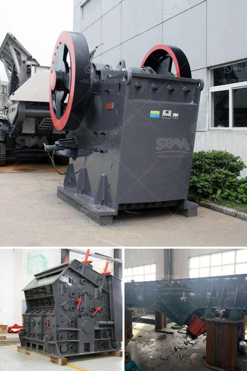

<h3>used stone cutting machine from japan</h3>
Are you in the stone cutting business and looking for a cost-effective solution to enhance your production capabilities? Look no further! Japan is renowned for its cutting-edge technology and precision engineering, and the market for used stone cutting machines from Japan is booming. Investing in a used stone cutting machine from Japan can offer numerous benefits, such as high-quality performance, durability, and affordability. In this article, we will explore the advantages of purchasing a used stone cutting machine from Japan.

First and foremost, Japanese stone cutting machines are synonymous with precision and accuracy. Japanese manufacturers pride themselves on their meticulous attention to detail and commitment to producing top-notch machinery. When it comes to stone cutting, precision is of utmost importance to ensure clean cuts and perfect finishes. By investing in a used stone cutting machine from Japan, you can leverage the expertise and craftsmanship that is synonymous with Japanese engineering. This means that you will be able to produce high-quality stone products that surpass industry standards and meet the expectations of your customers.

Durability is another key advantage of opting for a used stone cutting machine from Japan. Japanese manufacturers are known for their commitment to manufacturing robust and long-lasting machinery. Even if you are purchasing a pre-owned machine, you can rest assured that it has been crafted using superior materials and designed to withstand the test of time. The durability of Japanese stone cutting machines ensures that you will be able to operate your machine consistently without any downtime or costly repairs.

Furthermore, investing in a used stone cutting machine from Japan can offer significant cost savings. Brand new stone cutting machines can be quite expensive, especially if you are seeking cutting-edge technology. However, by purchasing a used machine, you can acquire cutting-edge features and functionality at a fraction of the price. The used machinery market in Japan offers a wide range of options to suit various budgets and requirements. Therefore, you can find a machine that meets your needs without breaking the bank.

In addition to the cost savings, purchasing a used stone cutting machine from Japan also allows you to capitalize on the reputation and reliability associated with Japanese manufacturing. Japanese machines are renowned for their high-quality standards and exceptional performance. By investing in a used stone cutting machine from Japan, you can leverage this reputation to enhance your business's credibility and attract more customers. The quality of your stone cutting products will speak volumes about your professionalism and dedication to excellence.

In conclusion, investing in a used stone cutting machine from Japan is a wise decision for any stone cutting business. The precision, durability, affordability, and reputation of Japanese machinery make it a compelling choice for both large-scale operations and small businesses. With a used machine, you can achieve high-quality cuts, increase your production capabilities, and save costs compared to purchasing brand new equipment. So, go ahead and explore the market for used stone cutting machines from Japan – you will find that it is a wise investment that pays dividends in the long run.
<h3>Contact us</h3><ul><li><strong>Whatsapp:&nbsp;<a href="https://wa.me/8613661969651">+8613661969651</a></strong></li><li><a href="https://swt.shibang-china.com/?git&amp;zhl&amp;used stone cutting machine from japan"><strong>Online Service(chat now)</strong></a></li></ul><h3>Related</h3><ul><li><a href='roller mill famsun.md'>roller mill famsun</a></li><li><a href='rent a conveyor belt.md'>rent a conveyor belt</a></li><li><a href='small rock crusher machine for sale.md'>small rock crusher machine for sale</a></li><li><a href='type of crushers.md'>type of crushers</a></li><li><a href='china dahua series jaw crusher.md'>china dahua series jaw crusher</a></li></ul>