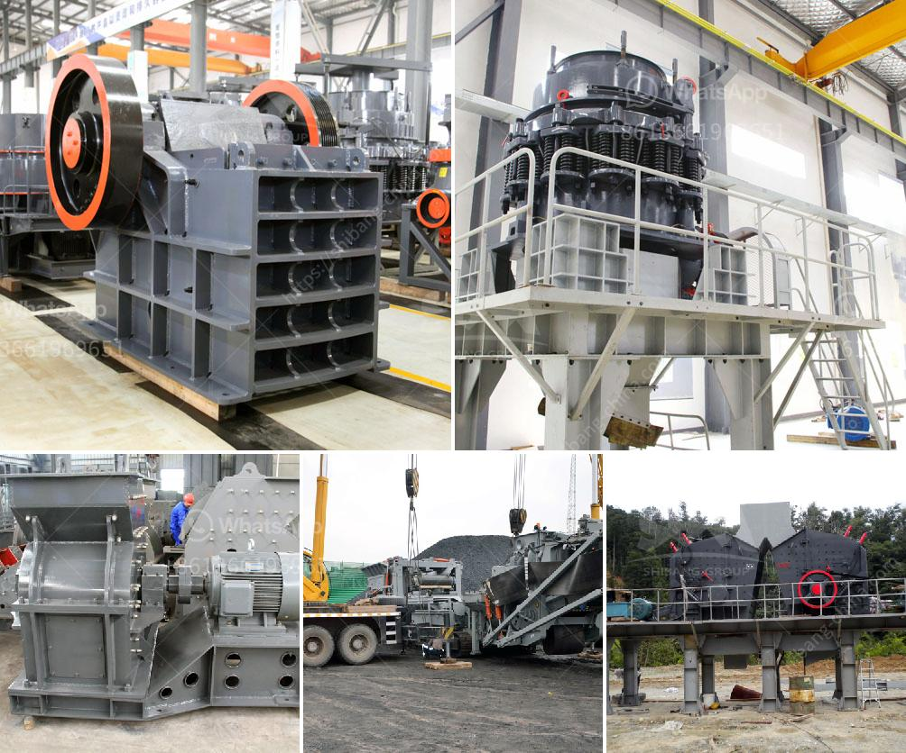

<h3>used vertical ball mill 200tph capacity</h3>
The used vertical ball mill is an excellent grinding solution that has been proven for the most efficient and reliable grinding operation. It has been utilized in the production of countless materials and transformed them into fine powder. The vertical ball mill is extensively suitable for grinding solid materials in industrial processes such as mineral dressing, building materials, and chemicals.

One of the striking features of the vertical ball mill is its versatility and efficiency. This machine can easily be adjusted to suit various needs and requirements. With a capacity of 200tph, it can cater to large-scale grinding operations. Additionally, it has a smaller footprint compared to other milling equipment, making it an ideal choice for confined spaces. This compact design also aids in reducing the cost of transportation and installation.

The used vertical ball mill is equipped with grinding discs, which are exposed to intense rotational forces to break down the material into smaller particles. The grinding process is aided by the presence of grinding balls inside the mill. These balls play a vital role in reducing the size of the material by applying force and creating impact. The material is then discharged through a discharge chute or into a classifier, depending on the specific application.

Another advantage of the used vertical ball mill is its ability to dry or wet grind materials. This flexibility allows for the processing of both dry and wet materials, making it suitable for a wide range of applications. The wet grinding process is particularly effective in producing ultra-fine powders and slurries. On the other hand, the dry grinding process is suitable for materials that require minimal moisture content.

In terms of energy efficiency, the used vertical ball mill excels as it consumes less energy compared to other grinding mills. This is primarily attributed to its high grinding efficiency and low power consumption. The vertical arrangement of the mill also contributes to its energy-saving capabilities, as it eliminates the need for auxiliary equipment such as hydro-cyclones or separators.

Furthermore, the used vertical ball mill offers ease of operation and maintenance. The machine is equipped with a user-friendly control panel and is designed to be easily accessible for maintenance and inspection. Regular maintenance ensures optimal performance and prolongs the lifespan of the machine.

In conclusion, the used vertical ball mill is a reliable and efficient grinding solution with a capacity of 200tph. Its compact design, versatility, and energy-saving features make it a preferred choice for various industries. Whether it is for mineral dressing, building materials, or chemicals, this machine guarantees optimal grinding performance.
<h3>Contact us</h3><ul><li><strong>Whatsapp:&nbsp;<a href="https://wa.me/8613661969651">+8613661969651</a></strong></li><li><a href="https://swt.shibang-china.com/?git&amp;zhl&amp;used vertical ball mill 200tph capacity"><strong>Online Service(chat now)</strong></a></li></ul><h3>Related</h3><ul><li><a href='cone crusher for sale nigeria.md'>cone crusher for sale nigeria</a></li><li><a href='mining process of marble crusher.md'>mining process of marble crusher</a></li><li><a href='quartz silica pulverizer machine.md'>quartz silica pulverizer machine</a></li><li><a href='coal screening plant.md'>coal screening plant</a></li><li><a href='china raymond mill company.md'>china raymond mill company</a></li></ul>