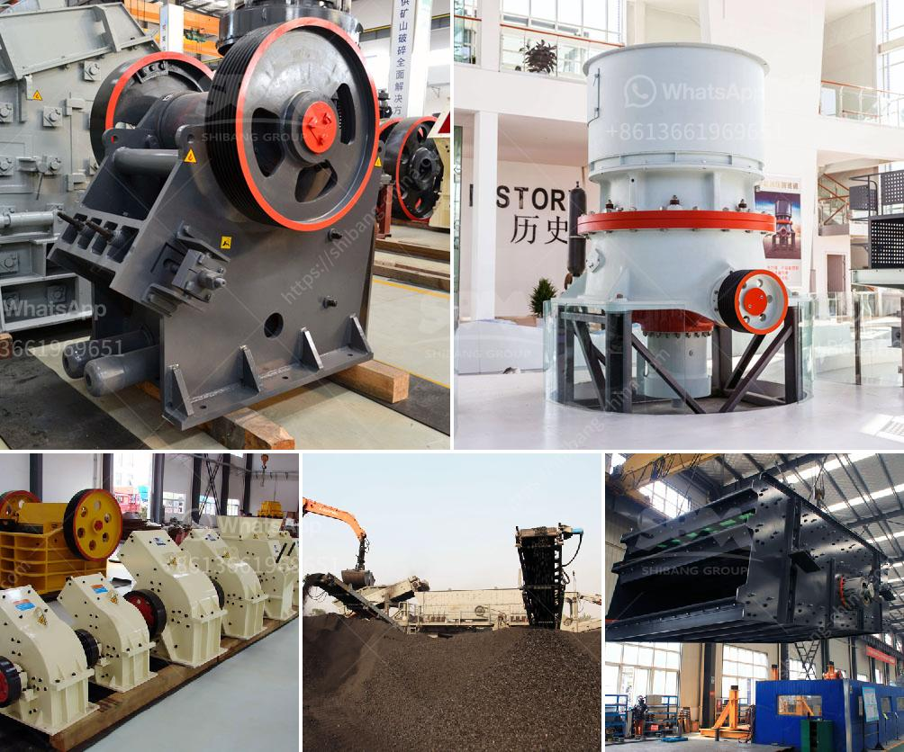

<h3>used zenith crusher sales nigeria</h3>
Nigeria is a vast country with substantial mineral resources, including crude oil, natural gas, tin, copper, and gold. However, the mining industry in Nigeria is still in its infancy, with only a few large-scale operations, which is mainly dominated by international companies. Nevertheless, there are significant opportunities for local entrepreneurs and small-scale miners to contribute to the sector's growth.

One area where local players can make a significant impact is in the crusher sales industry. Zenith, a leading global manufacturer of crushing and screening equipment, has been providing quality products and services to Nigeria for several years. Their advanced machinery and cutting-edge technology cater to the needs of the mining and construction industries, enabling efficient processing and production.

Used Zenith crushers offer cost-effective alternatives for purchasing expensive new equipment. They are well-suited for small-scale miners and entrepreneurs who want to enhance their operations without spending a fortune. These used crushers are thoroughly inspected and refurbished to ensure optimal performance, reliability, and longevity. As a result, buyers can acquire high-quality machines at a fraction of the cost, making it an attractive proposition for businesses operating on a limited budget.

The availability of used Zenith crushers in Nigeria presents a unique opportunity for local entrepreneurs. With the increasing demand for construction materials and the government's commitment to infrastructure development, the need for crushers is on the rise. By investing in used Zenith crushers, entrepreneurs can tap into this market and support the growth of the mining and construction sectors, while also generating a steady revenue stream for themselves.

In addition to their cost-effectiveness, used Zenith crushers offer versatility, allowing businesses to adapt to changing requirements. With their wide range of models and specifications, these crushers can handle various materials, such as limestone, granite, and asphalt, making them suitable for a wide range of applications. This flexibility further enhances their appeal to both large-scale operations and small-scale miners alike.

Furthermore, by opting for used Zenith crushers in Nigeria, buyers contribute to a more sustainable future. Recycling and reusing equipment not only reduces waste but also conserves natural resources and minimizes the need for new manufacturing processes. In a country like Nigeria, where environmental issues are becoming increasingly prominent, this sustainable approach resonates well with the local population, further enhancing the reputation and credibility of businesses that engage in responsible practices.

In conclusion, used Zenith crusher sales in Nigeria unlock significant opportunities for local entrepreneurs and small-scale miners to enhance their operations. By acquiring high-quality machinery at an affordable price, businesses can increase efficiency, productivity, and profitability. Moreover, by choosing used equipment, they contribute to a sustainable future and align themselves with the growing environmental consciousness in the country. With the demand for construction materials on the rise, now is the perfect time for Nigerian businesses to explore the benefits of used Zenith crushers and unlock their full potential.
<h3>Contact us</h3><ul><li><strong>Whatsapp:&nbsp;<a href="https://wa.me/8613661969651">+8613661969651</a></strong></li><li><a href="https://swt.shibang-china.com/?git&amp;zhl&amp;used zenith crusher sales nigeria"><strong>Online Service(chat now)</strong></a></li></ul><h3>Related</h3><ul><li><a href='dolomite crusher machine plant.md'>dolomite crusher machine plant</a></li><li><a href='portable gold recovery mill for sale.md'>portable gold recovery mill for sale</a></li><li><a href='mobile stone crusher plant.md'>mobile stone crusher plant</a></li><li><a href='sample gold processing and mining business plan pdf.md'>sample gold processing and mining business plan pdf</a></li><li><a href='to buy gypsum calcination rotary kiln plant.md'>to buy gypsum calcination rotary kiln plant</a></li></ul>