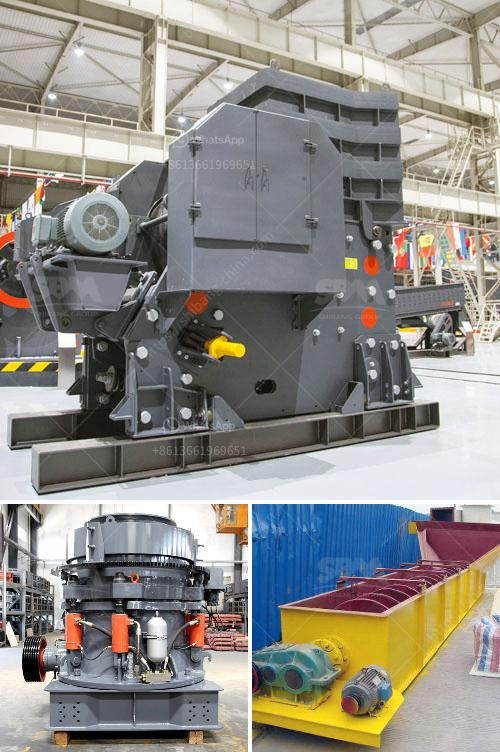

<h3>vertical ball grinding mills</h3>
Vertical ball grinding mills are used in a variety of industries, including mining, cement, and pharmaceuticals, to grind materials down to a fine powder. These mills consist of a series of grinding chambers filled with balls of different sizes, which collide with the material to be ground, breaking it down into smaller particles.

One of the key advantages of vertical ball grinding mills is their ability to grind materials in a very efficient manner. The vertical design of these mills allows them to use gravity to their advantage, as the balls cascade and tumble down the mill chambers. This cascading action ensures that the grinding balls come into contact with the material to be ground, resulting in a high impact and grinding efficiency.

Another advantage of vertical ball grinding mills is their compact size. Compared to traditional horizontal mills, which require large floor space, vertical mills have a smaller footprint. This makes them ideal for installation in areas where space is limited, such as underground mines or crowded manufacturing facilities.

Vertical ball grinding mills also offer a high degree of flexibility and customization. Different grinding chambers and liners can be used to tailor the mill's performance and efficiency to meet specific requirements. For example, in the mining industry, mills with rubber liners are often used to reduce wear and noise, while in the cement industry, mills with high-chrome steel liners are preferred for their abrasion resistance.

In addition to their efficiency and flexibility, vertical ball grinding mills are also known for their low energy consumption. Compared to traditional ball mills, which use horizontal rotation and require a large amount of energy to grind materials, vertical mills use a vertical rotation, resulting in lower energy consumption. This makes them more cost-effective and environmentally friendly, as they contribute to reducing energy consumption and greenhouse gas emissions.

Furthermore, vertical ball grinding mills are also designed to be easy to operate and maintain. They typically have a simple and straightforward control system, which allows operators to adjust the mill's speed, feed rate, and other parameters to achieve the desired grinding results. Additionally, regular maintenance and inspection of the mill components can help ensure its smooth operation and prevent unexpected downtime.

In conclusion, vertical ball grinding mills are an efficient and versatile solution for grinding a wide range of materials. Their vertical design, compact size, and low energy consumption make them ideal for various industries. Whether it is mining, cement, or pharmaceuticals, these mills provide an effective and reliable grinding solution. With their flexibility and customization options, they can be tailored to meet specific requirements and deliver the desired grinding results. Additionally, their easy operation and maintenance make them a practical choice for any application.
<h3>Contact us</h3><ul><li><strong>Whatsapp:&nbsp;<a href="https://wa.me/8613661969651">+8613661969651</a></strong></li><li><a href="https://swt.shibang-china.com/?git&amp;zhl&amp;vertical ball grinding mills"><strong>Online Service(chat now)</strong></a></li></ul><h3>Related</h3><ul><li><a href='mining characteristics of crusher.md'>mining characteristics of crusher</a></li><li><a href='crusher equipment supplier.md'>crusher equipment supplier</a></li><li><a href='quarry plant machinery.md'>quarry plant machinery</a></li><li><a href='rock crusher screen.md'>rock crusher screen</a></li><li><a href='ball mills in solidwork.md'>ball mills in solidwork</a></li></ul>