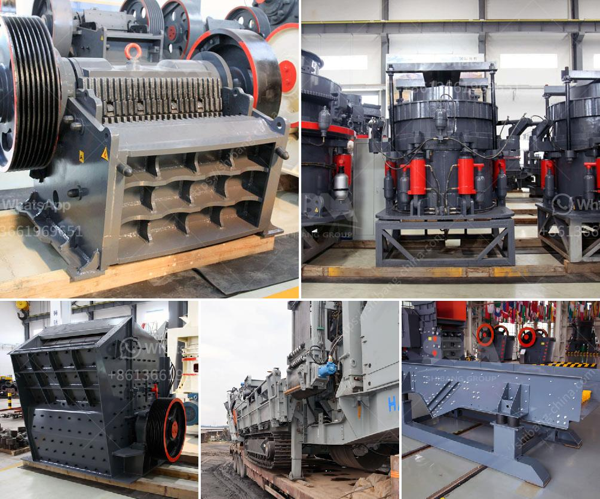

<h3>vertical ball mill</h3>
The vertical ball mill is a new type of grinding equipment widely used in industry in recent years. Its basic shape resembles a cylinder and is driven by a motor, which rotates the cylinder to cause grinding. The system is more efficient and has low noise compared to ball mills on the market today. This article will introduce the advantages and disadvantages of the vertical ball mill and its application in the grinding process.

One of the distinct advantages of the vertical ball mill is its high efficiency: It quickly and evenly grinds material to a smaller particle size, which is desirable for many industries. This efficiency is achieved through a compact design that allows the material to flow smoothly through the mill, minimizing dead zones and maximizing grinding capacity. Additionally, the vertical design reduces energy consumption compared to traditional ball mills, which further improves overall efficiency.

Another advantage of the vertical ball mill is its low noise level during operation. This is crucial in industrial settings where noise pollution can be a major concern. The design of the vertical ball mill ensures that noise is reduced to a minimum, making it suitable for use in noise-sensitive environments such as laboratories, research facilities, and production facilities where workers' health and well-being are a priority.

Despite its many advantages, the vertical ball mill also has some limitations. One of the main drawbacks is its high initial cost. The equipment is technologically advanced, and its design requires precise engineering and manufacturing, which increases the overall price. However, this initial investment can be offset by the long-term benefits of improved efficiency and reduced operating costs.

Another limitation of the vertical ball mill is its size. Due to its vertical orientation, the mill has a larger footprint compared to horizontal ball mills of similar capacity. This may be a significant factor to consider when space is limited or when integrating the mill into an existing production line.

Despite these limitations, the vertical ball mill has found applications in various industries. It is commonly used in the cement, coal, power plant desulfurization, metallurgy, chemical industry, non-metallic ore grinding, and other industries. The vertical ball mill has become an increasingly important part of the grinding process due to its efficiency and performance advantages.

In summary, the vertical ball mill is a new type of grinding equipment that offers many advantages in terms of efficiency, noise reduction, and overall cost-effectiveness. Although it has some limitations in terms of initial cost and size, its application in various industries highlights its importance in modern grinding processes. As technology continues to advance, it is likely that the vertical ball mill will become even more widely used in the future.
<h3>Contact us</h3><ul><li><strong>Whatsapp:&nbsp;<a href="https://wa.me/8613661969651">+8613661969651</a></strong></li><li><a href="https://swt.shibang-china.com/?git&amp;zhl&amp;vertical ball mill"><strong>Online Service(chat now)</strong></a></li></ul><h3>Related</h3><ul><li><a href='cone crusher from china.md'>cone crusher from china</a></li><li><a href='stone jaw crushers in japan.md'>stone jaw crushers in japan</a></li><li><a href='grinding machine capacity 1tph stone crusher machine.md'>grinding machine capacity 1tph stone crusher machine</a></li><li><a href='stone crushers in ethiopia.md'>stone crushers in ethiopia</a></li><li><a href='mining crusher plants in egypt.md'>mining crusher plants in egypt</a></li></ul>