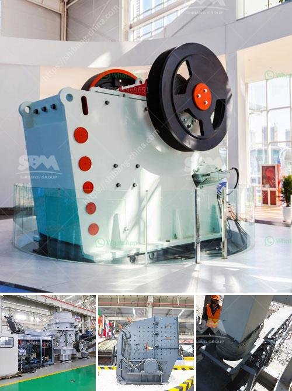

<h3>vertical ball mills</h3>
Ball mills are widely used in the mining industry for grinding various ores and other materials. They are typically horizontal cylinders that rotate around their axis, partially filled with the material to be ground plus the grinding medium. However, in recent years, there has been an increasing trend towards vertical ball mills, which offer several advantages over their horizontal counterparts. In this article, we will explore the features and benefits of vertical ball mills.

Vertical ball mills have a vertical orientation of the grinding chamber, hence the name. They are well-suited for applications where a higher level of grinding efficiency is required. Compared to horizontal ball mills, vertical mills can perform the same grinding tasks with lower energy consumption. This is because the grinding medium in vertical mills utilizes the force of gravity to contribute to the grinding process, reducing the need for additional energy input.

One significant advantage of vertical ball mills is their compact design. Vertical mills take up less space compared to their horizontal counterparts, making them ideal for plants with limited floor area. This compactness not only saves valuable space but also simplifies installation and maintenance. The vertical orientation also allows for effective segregation and classification of the grinding media, enhancing the overall efficiency of the mill.

Vertical ball mills are highly flexible and can be used for different types of grinding tasks. They can handle both wet and dry grinding, making them suitable for a variety of materials. This versatility is particularly useful in industries such as cement production, where both wet and dry grinding are commonly required. Additionally, vertical mills are capable of grinding materials with a wide range of hardness, ensuring optimal performance across various applications.

The design of vertical ball mills also allows for easy access to the grinding chamber, making maintenance and inspection tasks more straightforward. This accessibility is crucial for ensuring efficient operation and reducing costly downtime. Furthermore, vertical mills often feature an integrated classifier system, which further enhances their flexibility and efficiency by allowing for precise control over the size distribution of the final product.

Another advantage of vertical ball mills is their lower noise level compared to horizontal mills. The vertical orientation helps contain the grinding noise and vibrations, contributing to a quieter and more comfortable working environment.

In conclusion, vertical ball mills offer numerous benefits over their horizontal counterparts. Their compact design, energy efficiency, and versatility make them an attractive option for various grinding applications. Whether for wet or dry grinding, vertical mills deliver exceptional performance, ensuring high quality and consistent results. With easy access for maintenance and lower noise levels, vertical ball mills provide a reliable and efficient grinding solution for the mining industry and other sectors.
<h3>Contact us</h3><ul><li><strong>Whatsapp:&nbsp;<a href="https://wa.me/8613661969651">+8613661969651</a></strong></li><li><a href="https://swt.shibang-china.com/?git&amp;zhl&amp;vertical ball mills"><strong>Online Service(chat now)</strong></a></li></ul><h3>Related</h3><ul><li><a href='jaw crusher for sale ton per hour.md'>jaw crusher for sale ton per hour</a></li><li><a href='iron ore beneficiation plants price in china.md'>iron ore beneficiation plants price in china</a></li><li><a href='quartz stone quarry crusher in nigeria.md'>quartz stone quarry crusher in nigeria</a></li><li><a href='impact crushers manufacture.md'>impact crushers manufacture</a></li><li><a href='crushers of cone ethiopia.md'>crushers of cone ethiopia</a></li></ul>