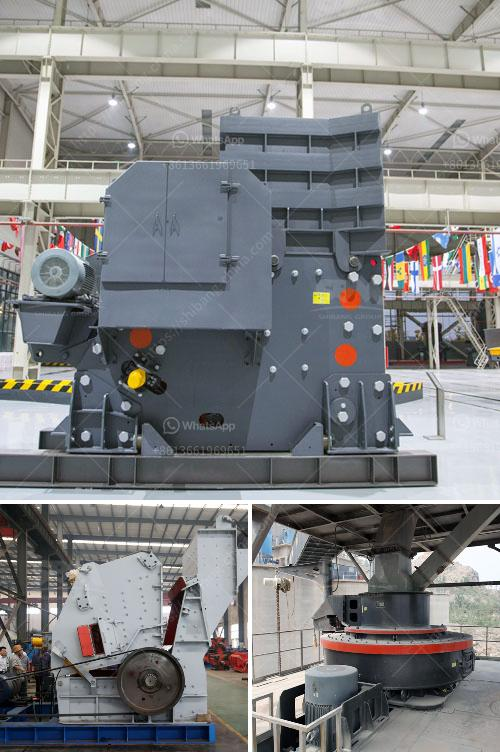

<h3>vertical mill cement</h3>
Cement is one of the most widely used materials in the construction industry, playing a crucial role in the development of infrastructure, residential buildings, and commercial complexes. However, traditional cement manufacturing processes have had a significant impact on the environment, leading to concerns about sustainability. In recent years, vertical mill cement has emerged as a viable alternative, offering numerous benefits in terms of efficiency, sustainability, and cost-effectiveness.

Vertical mill cement, also known as vertical roller mill (VRM), has been specifically designed to grind cement clinker and other materials to the desired fineness in cement production. The grinding process is carried out in a vertical mill, eliminating the need for additional grinding equipment. Many cement plants choose vertical mill for cement grinding due to several reasons such as lower power consumption, higher grinding efficiency, small floor space, and simple operation. It also has the ability to dry, grind and separate within a single unit, making it an ideal choice for newly established cement grinding plants.

One of the significant advantages of vertical mill cement is its low energy consumption. By using vertical mill technology, a cement plant can save up to 30% of energy compared to traditional ball mills. Since the vertical mill operates at a lower noise level, it is well suited for areas with strict environmental regulations, ensuring a sustainable and responsible approach towards cement production.

Furthermore, vertical mill cement helps overcome other challenges related to traditional cement manufacturing processes. Cement production is notorious for its significant CO2 emissions due to the high energy requirements of the clinkerization process. However, vertical mill cement offers a reprieve by employing dry grinding technology, resulting in lower moisture content and reducing the need for additional heat and energy during the grinding process. This translates into a reduced carbon footprint, making it a more environmentally friendly option.

Another advantage of vertical mill cement is its versatility. It can handle a wider range of materials, including limestone, slag, pozzolan, and fly ash, compared to traditional ball mills. This adaptability allows for greater flexibility in raw material selection, improving resource efficiency and reducing waste generation. The ability to mix various materials can result in enhanced cement characteristics, enabling the production of high-quality and sustainable construction materials.

Moreover, vertical mill cement is also cost-effective. In addition to the energy savings, the compact design of the vertical mill requires less infrastructure, reducing capital and installation costs. The lower maintenance requirements further contribute to cost savings, making it an economically viable solution for cement producers.

In conclusion, vertical mill cement represents a significant step towards sustainable construction. Its low energy consumption, environmental advantages, material versatility, and cost-effectiveness make it an attractive option for cement manufacturers worldwide. As the construction industry increasingly prioritizes sustainability, vertical mill cement provides a pathway to reducing carbon emissions while maintaining the quality and durability of the built environment. By embracing this innovative technology, cement producers can contribute to a greener and more sustainable future.
<h3>Contact us</h3><ul><li><strong>Whatsapp:&nbsp;<a href="https://wa.me/8613661969651">+8613661969651</a></strong></li><li><a href="https://swt.shibang-china.com/?git&amp;zhl&amp;vertical mill cement"><strong>Online Service(chat now)</strong></a></li></ul><h3>Related</h3><ul><li><a href='quarry crusher business in south africa.md'>quarry crusher business in south africa</a></li><li><a href='roller mill compontes.md'>roller mill compontes</a></li><li><a href='granite crusher processing machines south africa.md'>granite crusher processing machines south africa</a></li><li><a href='list of crusher in bharatpur distric.md'>list of crusher in bharatpur distric</a></li><li><a href='stone crusher mesin malaysia.md'>stone crusher mesin malaysia</a></li></ul>