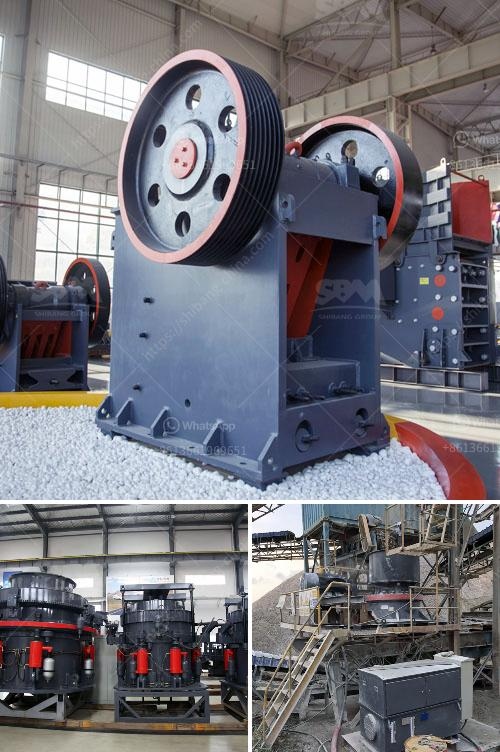

<h3>vertical mill for</h3>
The vertical mill is a highly efficient and versatile machine that is widely used in various industries. It is suitable for grinding materials with different hardness levels, from soft to very hard. In addition, it can handle a wide range of materials, including those with a high moisture content or those that are highly abrasive.

One of the key advantages of the vertical mill is its ability to produce a uniform particle size distribution. This is achieved through the use of a rotating grinding table, on which the material is fed and ground by rollers. The rollers exert both compressive and shearing forces on the material, resulting in a fine and consistent grind.

Another benefit of the vertical mill is its compact design. Unlike horizontal mills, which require a large amount of floor space, the vertical mill can be easily integrated into existing production lines. This makes it a cost-effective choice for companies looking to increase their milling capacity without having to invest in additional floor space.

Furthermore, the vertical mill offers excellent energy efficiency. Its design allows for the effective utilization of both grinding media and energy, resulting in lower operating costs. This is particularly important in industries where energy consumption is a significant factor in overall production costs.

Additionally, the vertical mill can be equipped with various accessories and tools, further enhancing its versatility. These accessories include classifiers, rotary feeders, and separators, among others. These additional features allow for increased control over the grinding process and improved product quality.

In conclusion, the vertical mill is a highly efficient and versatile machine that offers a wide range of benefits. Its ability to produce a uniform particle size distribution, compact design, energy efficiency, and versatile accessories make it a valuable tool for various industries. Whether grinding a soft or hard material, the vertical mill is a reliable choice for achieving consistent and high-quality results.
<h3>Contact us</h3><ul><li><strong>Whatsapp:&nbsp;<a href="https://wa.me/8613661969651">+8613661969651</a></strong></li><li><a href="https://swt.shibang-china.com/?git&amp;zhl&amp;vertical mill for"><strong>Online Service(chat now)</strong></a></li></ul><h3>Related</h3><ul><li><a href='rock crushing and ballast.md'>rock crushing and ballast</a></li><li><a href='working of hydraulic circuit for milling machine.md'>working of hydraulic circuit for milling machine</a></li><li><a href='stone quarry companies in ghana.md'>stone quarry companies in ghana</a></li><li><a href='zambia mining conveyor belt.md'>zambia mining conveyor belt</a></li><li><a href='saudi arabia used conveyor belts price.md'>saudi arabia used conveyor belts price</a></li></ul>