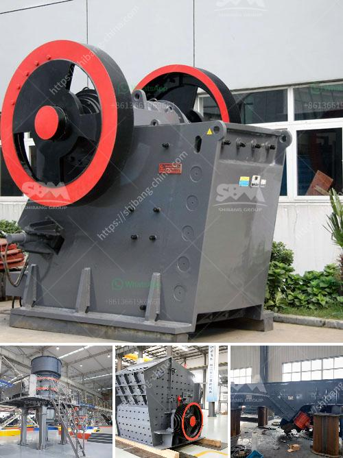

<h3>vertical mill mining</h3>
The mining industry plays a significant role in the global economy, providing essential materials for various sectors. However, traditional mining methods often come with substantial environmental challenges and safety risks. In recent years, vertical mill mining technology has emerged as a game-changer, revolutionizing the industry by offering numerous benefits that enhance efficiency, sustainability, and safety.

Vertical mill mining refers to the process of extracting minerals and ores using vertical mills, which utilize gravity and centrifugal forces to grind materials into smaller particles. This technique eliminates the need for traditional horizontal grinding mills, reducing energy consumption and allowing for finer particle sizes. By grinding ores into smaller particles, vertical mill mining enables more efficient mineral extraction and processing, leading to higher yields and reduced waste.

One of the significant advantages of vertical mill mining is its environmental impact. By employing gravity and centrifugal forces, this technique minimizes the need for water and chemicals, reducing the overall carbon footprint and water consumption compared to traditional mining methods. Additionally, vertical mills are enclosed systems that significantly minimize dust emissions, improving air quality and worker safety.

Furthermore, vertical mill mining offers flexibility in processing various types of minerals and ores. With its ability to achieve finer particle sizes, this technology allows for a more precise separation of valuable minerals from waste materials, increasing the overall purity and quality of the extracted ores. This flexibility also enables mining companies to adapt quickly to changing market demands and process a wide range of materials, expanding their potential revenue sources.

In conclusion, vertical mill mining represents a groundbreaking advancement in the mining industry. By combining efficiency, sustainability, and safety, this technology offers numerous benefits that improve mineral extraction, processing, and ultimately, the overall productivity of the mining operations. As the industry continues to evolve, vertical mill mining is expected to become increasingly prominent, revolutionizing the way minerals and ores are extracted and processed.
<h3>Contact us</h3><ul><li><strong>Whatsapp:&nbsp;<a href="https://wa.me/8613661969651">+8613661969651</a></strong></li><li><a href="https://swt.shibang-china.com/?git&amp;zhl&amp;vertical mill mining"><strong>Online Service(chat now)</strong></a></li></ul><h3>Related</h3><ul><li><a href='cost of quarry crusher machines.md'>cost of quarry crusher machines</a></li><li><a href='high capacity fine stone quarry crusher machine.md'>high capacity fine stone quarry crusher machine</a></li><li><a href='crushing equipment for rent.md'>crushing equipment for rent</a></li><li><a href='portable gold mining plant pdf.md'>portable gold mining plant pdf</a></li><li><a href='gold crushers sale.md'>gold crushers sale</a></li></ul>