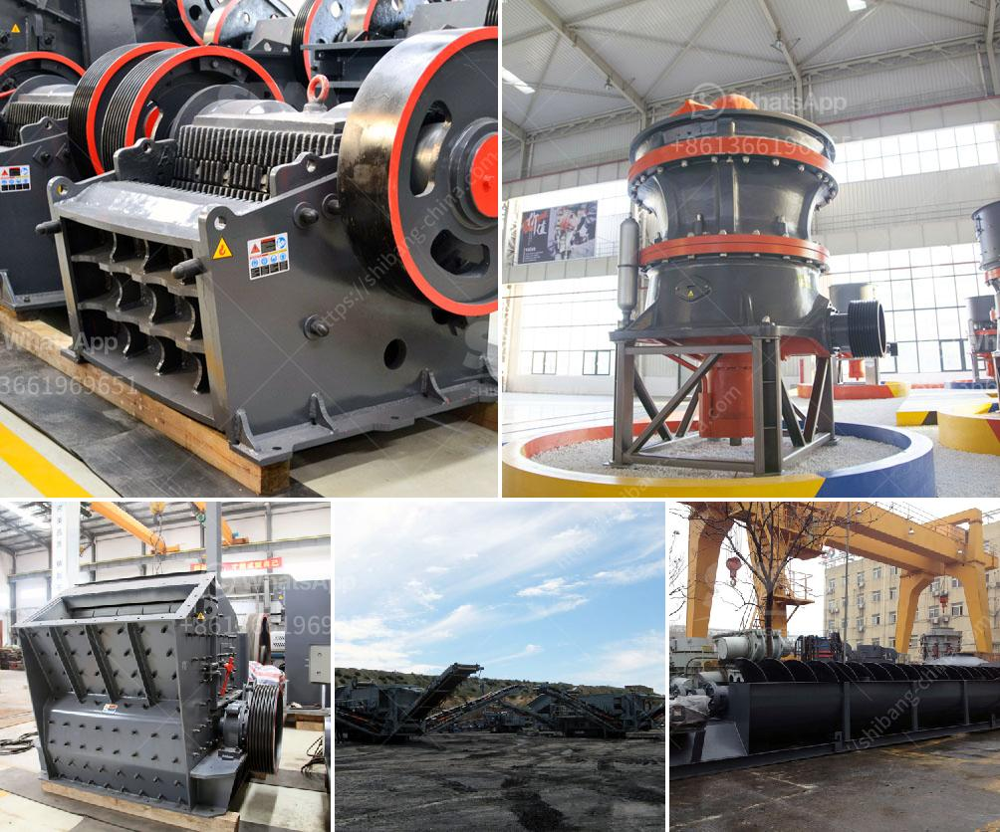

<h3>vertical mills retention time formula</h3>
Vertical mills are widely used in industries such as cement, power generation, metallurgy, chemical and mineral processing for grinding raw materials or cement clinker. One crucial aspect of the operation of vertical mills is the retention time, which refers to the duration of material staying in the mill.

The retention time in a vertical mill is influenced by several factors, including the feed size, grinding media size, mill diameter, classifier speed, and mill ventilation. A longer retention time means that more material can be processed, resulting in finer grind size and improved product quality. Therefore, it is important to understand the retention time formula for vertical mills to optimize their operation.

The retention time in a vertical mill is typically calculated based on the residence time of the material in the grinding chamber. The residence time is defined as the ratio of the amount of material in the mill to the feed rate. It can be expressed as:

To determine the material feed rate, the mill throughput, or the amount of material passing through the mill per unit time, needs to be known. This can be measured directly or calculated based on the feed size distribution and mill dimensions.

The material in the mill refers to the total mass of the grinding media and the particles being ground. It is calculated by multiplying the bulk density of the material by the effective volume of the grinding chamber. The bulk density can be obtained from material data sheets or determined experimentally. The effective volume of the grinding chamber can be calculated by multiplying the cross-sectional area of the mill by the length of the grinding chamber.

Once the material in the mill and the material feed rate are determined, the retention time can be calculated by dividing the material in the mill by the material feed rate.

It is important to note that the retention time formula provides an estimate and may not account for all factors affecting the actual retention time in a vertical mill. For example, variations in feed size distribution or changes in mill operation can affect the material flow and retention time.

To optimize the retention time and the overall operation of a vertical mill, the following considerations should be taken into account:

1. Adjusting the feed rate: Controlling the material feed rate can help to achieve the desired retention time and avoid overloading the mill.

2. Optimizing the mill ventilation: Proper mill ventilation can help to control the residence time by preventing material from settling and accumulating in the mill.

3. Monitoring the grinding process: Regular monitoring of the mill operation, including feed rate, mill power consumption, and product fineness, can help to identify any deviations from the desired retention time and make necessary adjustments.

In conclusion, the retention time formula is an important tool for understanding and optimizing the operation of vertical mills. By calculating and controlling the retention time, operators can achieve finer grind size and improved product quality. However, it is essential to consider other factors and monitor the mill operation to ensure optimal performance.
<h3>Contact us</h3><ul><li><strong>Whatsapp:&nbsp;<a href="https://wa.me/8613661969651">+8613661969651</a></strong></li><li><a href="https://swt.shibang-china.com/?git&amp;zhl&amp;vertical mills retention time formula"><strong>Online Service(chat now)</strong></a></li></ul><h3>Related</h3><ul><li><a href='stone crushing plant project report.md'>stone crushing plant project report</a></li><li><a href='ultra fine grinding mills.md'>ultra fine grinding mills</a></li><li><a href='how to make unq stone crusher.md'>how to make unq stone crusher</a></li><li><a href='cost of setting up a quarry crusher in nigeria.md'>cost of setting up a quarry crusher in nigeria</a></li><li><a href='sand crusher plant.md'>sand crusher plant</a></li></ul>