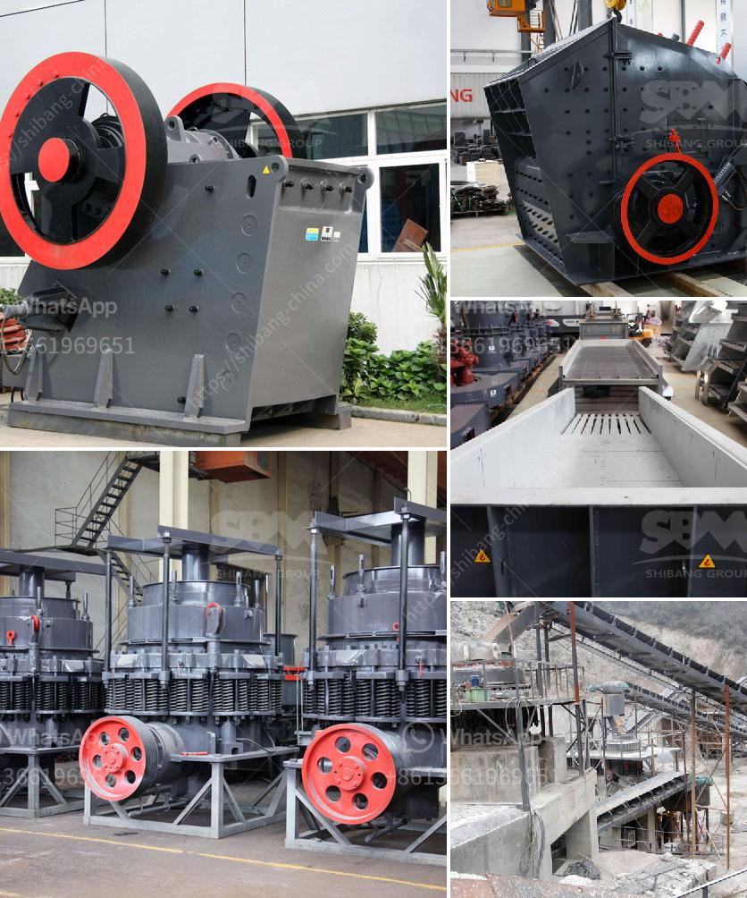

<h3>vertical roller mill for cement</h3>
The cement industry is an essential part of the construction industry. The modernization and expansion of existing cement plants have also increased the demand for high-quality materials. The production process in cement plants has undergone significant changes in recent years. This is mainly due to the introduction of new technology and equipment, such as vertical roller mills (VRMs).

Vertical roller mills have gained popularity in the cement industry for their ability to dry, grind, and separate materials efficiently. This process offers several advantages over conventional methods, such as reducing energy consumption and increasing lifespan of equipment. In this article, we will explore the features and benefits of vertical roller mills for cement production.

Firstly, vertical roller mills are highly energy-efficient. They consume less power than ball mills, which helps in reducing overall energy consumption. This is crucial for cement plants as energy costs are one of the highest operational expenses. With a vertical roller mill, the energy consumption can be reduced by up to 40% compared to a traditional ball mill. The VRM also allows better control over the grinding process, resulting in more consistent and reliable product quality.

Secondly, vertical roller mills provide excellent drying capabilities. Traditional grinding methods require additional equipment for drying the raw materials before the grinding process. However, VRMs have an integrated drying system, which eliminates the need for separate dryers. This not only saves space but also reduces the overall investment costs.

Furthermore, vertical roller mills offer superior grinding efficiency. The grinding process in a VRM is carried out with a combination of compression and shearing forces, which results in a finer and more uniform product. The VRM also allows for a greater range of particle sizes, which is essential in producing different types of cement. The ability to control the particle size distribution allows cement plants to optimize the performance of each product.

In addition, vertical roller mills have a longer lifespan compared to traditional ball mills. The wear and tear on the grinding rollers and table surfaces are minimized, resulting in reduced maintenance and downtime. The VRM's robust design and high-quality materials used in construction contribute to its durability and longevity.

Lastly, vertical roller mills have a small footprint. This is particularly beneficial for cement plants with limited space or those looking to expand their production facilities. The compact design of a VRM allows for easy installation and integration into existing systems. It also provides flexibility in terms of plant layout and configuration.

In conclusion, vertical roller mills have revolutionized the cement industry by providing energy-efficient, reliable, and versatile solutions for cement production. The ability to dry, grind, and separate materials in a single unit offers numerous benefits such as reduced energy consumption, increased product quality, and improved operational efficiency. Cement plants around the world are embracing VRMs as a sustainable and cost-effective solution for their grinding needs. With ongoing advancements in technology, the future of vertical roller mills in cement production looks promising.
<h3>Contact us</h3><ul><li><strong>Whatsapp:&nbsp;<a href="https://wa.me/8613661969651">+8613661969651</a></strong></li><li><a href="https://swt.shibang-china.com/?git&amp;zhl&amp;vertical roller mill for cement"><strong>Online Service(chat now)</strong></a></li></ul><h3>Related</h3><ul><li><a href='barite crushing machine.md'>barite crushing machine</a></li><li><a href='small rock crusher machine for sale.md'>small rock crusher machine for sale</a></li><li><a href='grinding silica sand process.md'>grinding silica sand process</a></li><li><a href='china gold water grinding mills.md'>china gold water grinding mills</a></li><li><a href='i am looking for a stone crusher in malaysia.md'>i am looking for a stone crusher in malaysia</a></li></ul>