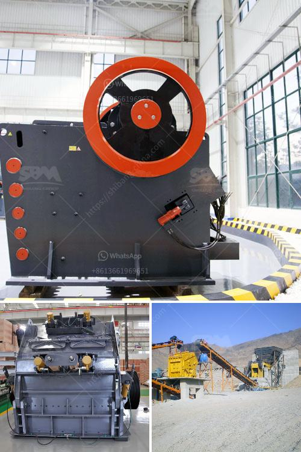

<h3>vertical roller mill in cement plant</h3>
Vertical roller mill is a type of industrial equipment used to crush or grind materials into small particles. It is widely used in the concrete and mining fields, and are also used to process gypsum. These units can process both raw and recycled materials, while helping to reduce waste and preserve virgin supplies of these materials.

The vertical roller mill has been widely used and promoted in the electric power, metallurgy, chemical industry, non-metal industry because the overall efficiency attributed to energy-saving and low consumption is becoming more and more evident in the cement industry.

GrM series vertical roller mill is developed with the features of high efficiency, energy-saving and environmental protection which is achieved after exchanging ideas with senior experts from home and abroad and making improvements based on same sector experience in the past years.

GrM series is mainly equipped with powder concentrator, high pressure grinding roller device, reducer, motor, shell and other components. When working, raw materials are continuously fed into the grinding mill through the weighing hopper without stop due to the spare blade in the grinding mill.

In cement plant, cement roller press is a kind of important cement equipment used for clinker grinding. It is usually combined with a cement ball mill to form a high-efficiency cement grinding system because the practice shows that the grinding process with small grinding ratio and step-by-step completion is more energy-saving than that with large one-time completion.

Vertical roller mills are the key equipment used for coal pulverization in cement plants. Coal pulverization is the process of grinding coal particles down to a very fine size in order to burn efficiently in the kiln. The coal pulverizer is the most critical component of coal-fired power plants, as it provides the fuel that powers the combustion process. Additionally, it helps to increase the efficiency of the boiler by allowing more air into the combustion chamber and thus decreasing the amount of excess air that must be heated. Overall, vertical roller mills are an energy-efficient substitute for conventional coal pulverization systems in cement plants.
<h3>Contact us</h3><ul><li><strong>Whatsapp:&nbsp;<a href="https://wa.me/8613661969651">+8613661969651</a></strong></li><li><a href="https://swt.shibang-china.com/?git&amp;zhl&amp;vertical roller mill in cement plant"><strong>Online Service(chat now)</strong></a></li></ul><h3>Related</h3><ul><li><a href='iron ore crushing and screening.md'>iron ore crushing and screening</a></li><li><a href='petroleum coke crushing plant.md'>petroleum coke crushing plant</a></li><li><a href='ball mill brochure eccentric outer cone crusher.md'>ball mill brochure eccentric outer cone crusher</a></li><li><a href='gypsum milling prices in kenya.md'>gypsum milling prices in kenya</a></li><li><a href='cost of setting a sand crushing plant in india.md'>cost of setting a sand crushing plant in india</a></li></ul>