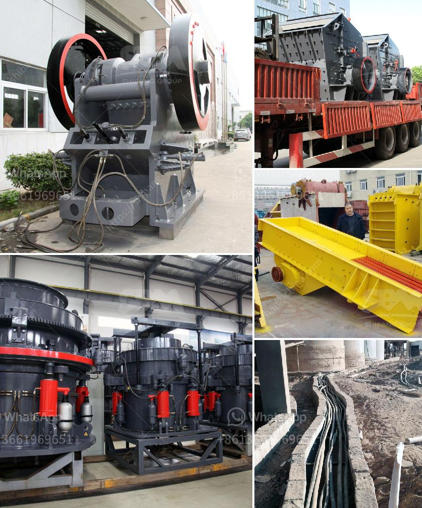

<h3>vertical shaft impact crusher south africa</h3>
South Africa is deemed to have some of the world's most progressive industries, offering a range of machinery that propels economic growth. One such development is the Vertical Shaft Impact Crusher (VSI) that offers a pioneering approach to shaping sand and other ore materials. With its unique rock-on-rock crushing mechanism, South Africa's VSI crusher enhances the shaping of aggregates by significantly reducing the presence of flat and elongated particles. This article highlights the various benefits of the Vertical Shaft Impact Crusher in South Africa, particularly in the crushing and shaping of rocks and ores.

The primary function of the vertical shaft impact crusher is to reshape and reduce the size of raw materials and ores. This versatile system allows for the crushing of hard rocks, ore materials, and aggregates, ensuring high-quality production. The VSI crusher can be adjusted to perform various crushing tasks, making it ideal for a wide range of applications, such as producing manufactured sand, concrete aggregates, and asphalt materials.

In South Africa, where aggregate quality plays a vital role in construction projects, the VSI crusher is becoming increasingly popular for its ability to deliver enhanced particle shape and gradation control. Traditional crushers tend to produce more elongated and flaky particles, negatively impacting the quality of the final product. However, the Vertical Shaft Impact Crusher employs a unique rock-on-rock crushing technique that guarantees excellent particle shape for superior usability in various construction applications.

The VSI crusher boasts a strong reputation in South Africa for reducing maintenance costs and downtime. This is attributed to its durable and wear-resistant components that require minimal maintenance. Additionally, the crusher is designed with easily accessible internal parts, allowing for straightforward inspection, cleaning, and maintenance, enhancing operational efficiency and minimizing service interruptions.

In line with global efforts to reduce carbon footprints, the Vertical Shaft Impact Crusher offers exceptional energy efficiency. By employing a rock-on-rock crushing mechanism, the VSI crusher consumes significantly less energy compared to traditional crushers that utilize impact or compression methods. This leads to lower energy costs, reduced emissions, and a greener production process, thus contributing to sustainable development and environmental conservation in South Africa's mining and construction sectors.

Undoubtedly, the Vertical Shaft Impact Crusher has revolutionized the South African mining and construction industries. With its ability to reshape aggregates and ores while ensuring exceptional particle shape and gradation control, this highly versatile machine delivers high-quality outputs across various applications. Moreover, its reduced maintenance requirements, energy efficiency, and environmental friendliness make it an excellent choice for companies seeking cost-effective and sustainable solutions. As South Africa continues to embrace technological advancements, the Vertical Shaft Impact Crusher stands out as a crucial asset for enhancing efficiency and quality within the national industries.
<h3>Contact us</h3><ul><li><strong>Whatsapp:&nbsp;<a href="https://wa.me/8613661969651">+8613661969651</a></strong></li><li><a href="https://swt.shibang-china.com/?git&amp;zhl&amp;vertical shaft impact crusher south africa"><strong>Online Service(chat now)</strong></a></li></ul><h3>Related</h3><ul><li><a href='coal crushing plant.md'>coal crushing plant</a></li><li><a href='i am looking for a stone crusher in malaysia.md'>i am looking for a stone crusher in malaysia</a></li><li><a href='sand crusher cost.md'>sand crusher cost</a></li><li><a href='roller conveyor belts.md'>roller conveyor belts</a></li><li><a href='complete crusher plant for sale.md'>complete crusher plant for sale</a></li></ul>