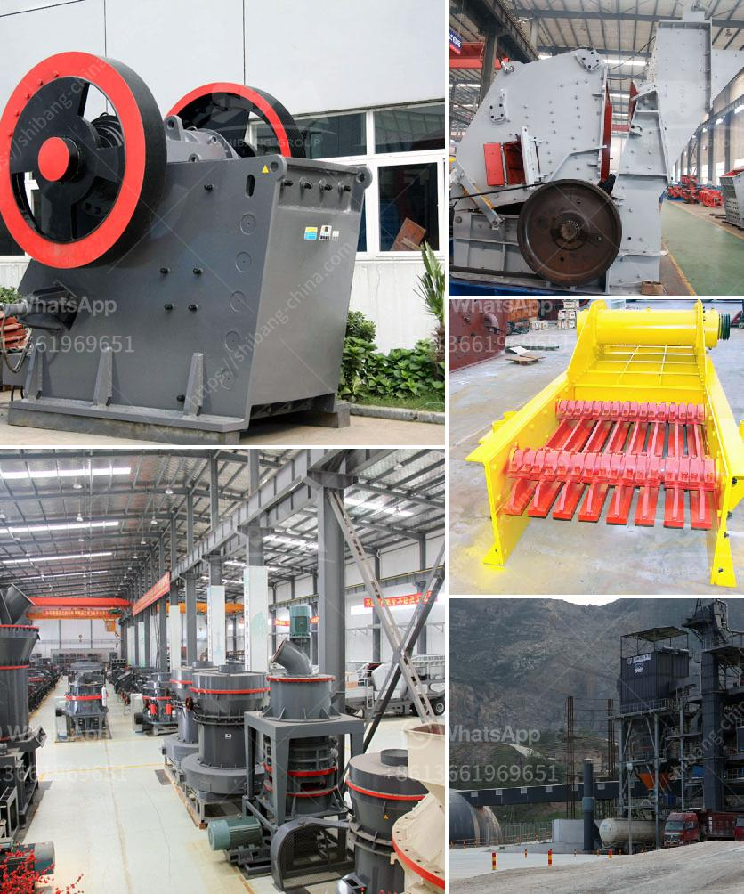

<h3>vertical shaft impact crushers</h3>
Vertical shaft impact crushers, also known as VSI crushers, are essential pieces of equipment in the construction industry. These machines can be used for their excellent shaping capabilities and can produce high-quality aggregates for various applications.

One of the main advantages of vertical shaft impact crushers is their ability to handle hard and abrasive materials. They are designed to fracture materials, such as rocks, through the use of fast-rotating anvils, producing a consistent and cubical product. This makes them ideal for producing aggregates for concrete and asphalt production.

Furthermore, vertical shaft impact crushers are versatile machines that can be used in both stationary and portable applications. They can be easily integrated into existing crushing circuits or operated as standalone units. This flexibility allows them to be used in a wide range of industries, including mining, construction, and recycling.

Another key feature of vertical shaft impact crushers is their low maintenance requirements. The simple design of these machines reduces the number of moving parts, decreasing the chances of mechanical failure and making maintenance tasks easier and less time-consuming.

In terms of energy efficiency, vertical shaft impact crushers are also highly desirable. They operate by utilizing the kinetic energy of the materials fed into the crusher, which minimizes energy consumption. This not only reduces operational costs but also contributes to a more sustainable and environmentally friendly operation.

In conclusion, vertical shaft impact crushers are invaluable crushing machines in the construction industry. Their ability to produce high-quality aggregates, handle abrasive materials, and require low maintenance make them a cost-effective and efficient choice for any crushing operation.
<h3>Contact us</h3><ul><li><strong>Whatsapp:&nbsp;<a href="https://wa.me/8613661969651">+8613661969651</a></strong></li><li><a href="https://swt.shibang-china.com/?git&amp;zhl&amp;vertical shaft impact crushers"><strong>Online Service(chat now)</strong></a></li></ul><h3>Related</h3><ul><li><a href='vertical shaft impact crushers.md'>vertical shaft impact crushers</a></li><li><a href='running sponge iron plant for sale in gujarat.md'>running sponge iron plant for sale in gujarat</a></li><li><a href='chrome mining methods in zimbabwe.md'>chrome mining methods in zimbabwe</a></li><li><a href='fine cone crusher.md'>fine cone crusher</a></li><li><a href='impact crusher for sale in turkey.md'>impact crusher for sale in turkey</a></li></ul>