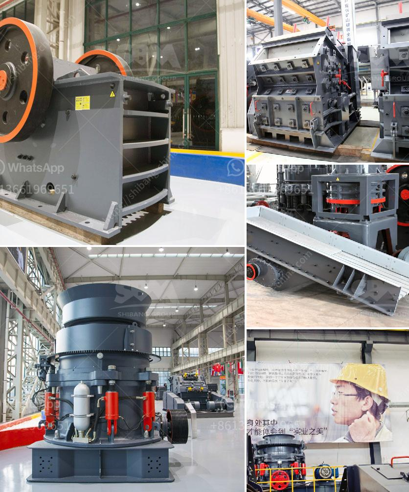

<h3>vertical vertical inspection method</h3>
Vertical inspection is a vital method used in various industries to examine the structural integrity, safety, and functionality of vertical structures such as buildings, towers, bridges, and high-rise constructions. This method involves the thorough inspection of both the interior and exterior parts of these structures, ensuring that they meet regulatory standards and pose no risks to human life or property.

One of the primary reasons for conducting vertical inspections is to identify any potential defects or weaknesses in the structure. These defects can be caused by factors such as aging, weathering, seismic activities, or poor maintenance practices. By identifying these issues through regular inspections, necessary repairs or reinforcements can be carried out, preventing more significant problems in the future.

The vertical inspection process includes several key steps. Firstly, a detailed examination of the structure's exterior is conducted to identify any visible signs of damage, including cracks, corrosion, or deterioration. This is often done using binoculars or drones to assess areas that may be difficult to access physically. Special attention is given to areas susceptible to wear and tear, such as joints, foundations, and vulnerable sections.

The next step in a vertical inspection is entering the structure itself to examine the interior components. This is usually accomplished by using specialized equipment such as lifts, scaffolding, or rappelling techniques. The goal is to inspect elements like walls, floors, columns, beams, and other structural elements for signs of damage or deformation. In addition, electrical, plumbing, and HVAC systems are checked to ensure they are functioning properly.

Throughout the vertical inspection process, inspectors may use various tools and techniques to aid them in their assessment. These can include ultrasonic testing to detect internal defects, thermography to identify heat anomalies or insulation problems, or non-destructive testing to assess the integrity of critical components.

Compliance with safety regulations and codes is another crucial aspect of vertical inspections. Inspectors carefully analyze the structure to ensure it meets industry standards and is in line with building codes. They assess factors such as fire safety, emergency exits, accessibility standards, and compliance with zoning requirements. Any non-compliance issues are documented and reported to the appropriate authorities for further action.

The frequency of vertical inspections may vary depending on the nature of the structure and its usage. While some structures may only require periodic inspections, others, especially those subject to heavy loads or extreme conditions, may need more frequent and comprehensive assessments. Regular inspections and timely maintenance can significantly extend the lifespan and durability of a structure, reducing the risk of unexpected failures and costly repairs.

In conclusion, vertical inspection is a vital method for ensuring the safety, integrity, and functionality of various vertical structures. By conducting thorough examinations of both the exterior and interior components, potential defects or weaknesses can be identified and addressed promptly. This helps to prevent accidents, maintain compliance with safety regulations, and extend the lifespan of the structures. Whether it’s a towering skyscraper or a simple bridge, the importance of vertical inspections cannot be overstated in maintaining the safety of our built environment.
<h3>Contact us</h3><ul><li><strong>Whatsapp:&nbsp;<a href="https://wa.me/8613661969651">+8613661969651</a></strong></li><li><a href="https://swt.shibang-china.com/?git&amp;zhl&amp;vertical vertical inspection method"><strong>Online Service(chat now)</strong></a></li></ul><h3>Related</h3><ul><li><a href='portable sand washing machine.md'>portable sand washing machine</a></li><li><a href='chinese aggregate crusher suppliers.md'>chinese aggregate crusher suppliers</a></li><li><a href='working of hydraulic circuit for milling machine.md'>working of hydraulic circuit for milling machine</a></li><li><a href='used ball mill south africa.md'>used ball mill south africa</a></li><li><a href='mobile rock crushing plant nigeria.md'>mobile rock crushing plant nigeria</a></li></ul>