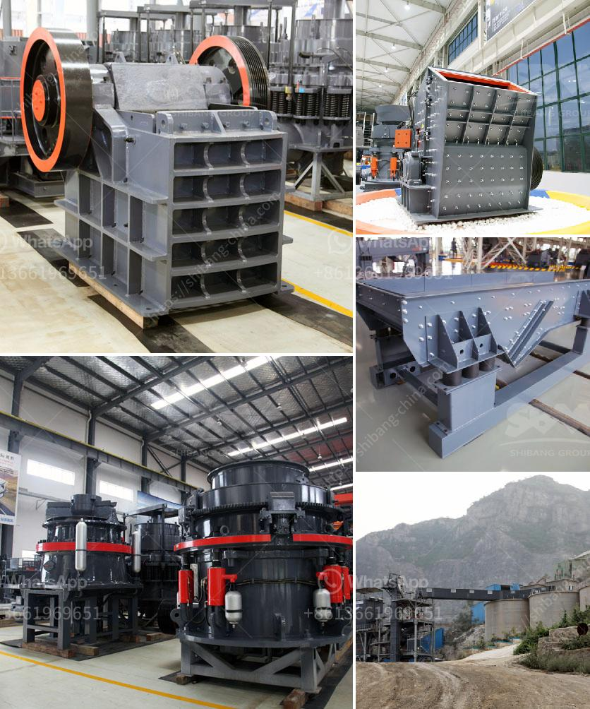

<h3>vertical vertical roller mill</h3>
Vertical roller mill is a type of industrial equipment used to crush or grind materials into small particles. It is widely used in the concrete and mining fields, and are also used to process gypsum. These units can process both raw and recycled materials, while helping to reduce waste and preserve virgin supplies of these materials.

Vertical roller mills are widely used in the cement industry and are ideal for producing cement, clinker, blast furnace slag, and limestone. They are capable of grinding materials with different hardness levels, allowing them to be ground to various finenesses. This versatility makes vertical roller mills suitable for a wide range of applications.

One of the key advantages of a vertical roller mill compared to other grinding machines is the ability to grind materials with a higher fineness. In addition, these units have a smaller footprint compared to ball mills, making them more economical and environmentally friendly. This is especially important in urban areas where space is limited.

Another advantage of vertical roller mills is their high drying capacity. The material is dried in the mill and can be quickly and easily discharged from the grinding chamber. This reduces the need for additional drying equipment and lowers energy consumption. The high drying capacity also ensures that the material is properly dried before it is ground, which improves the overall efficiency of the grinding process.

Vertical roller mills are also known for their energy efficiency. By using less energy to grind particles, these mills help reduce energy consumption and lower operational costs. This is particularly important in industries where energy costs account for a large portion of operating expenses. In addition, the compact design of these mills helps minimize energy loss during the grinding process, further improving their efficiency.

Vertical roller mills are also versatile in terms of the materials they can grind. From limestone to gypsum, clinker to blast furnace slag, they can process a wide range of materials. This flexibility makes them an ideal choice for industries that need to process different materials in a single unit.

In conclusion, vertical roller mills are a efficient and versatile grinding solution that can be used in a variety of industries. Their ability to grind materials to a higher fineness, their low energy consumption, and their compact design make them a cost-effective option for grinding operations. With the ability to process a wide range of materials, vertical roller mills offer flexibility and efficiency in the cement and mining industries.
<h3>Contact us</h3><ul><li><strong>Whatsapp:&nbsp;<a href="https://wa.me/8613661969651">+8613661969651</a></strong></li><li><a href="https://swt.shibang-china.com/?git&amp;zhl&amp;vertical vertical roller mill"><strong>Online Service(chat now)</strong></a></li></ul><h3>Related</h3><ul><li><a href='cement production process.md'>cement production process</a></li><li><a href='costo equipos de la planta de cemento.md'>costo equipos de la planta de cemento</a></li><li><a href='stone crushers baby.md'>stone crushers baby</a></li><li><a href='50 tph stone crusher plant price.md'>50 tph stone crusher plant price</a></li><li><a href='cement grinding ball mill process.md'>cement grinding ball mill process</a></li></ul>