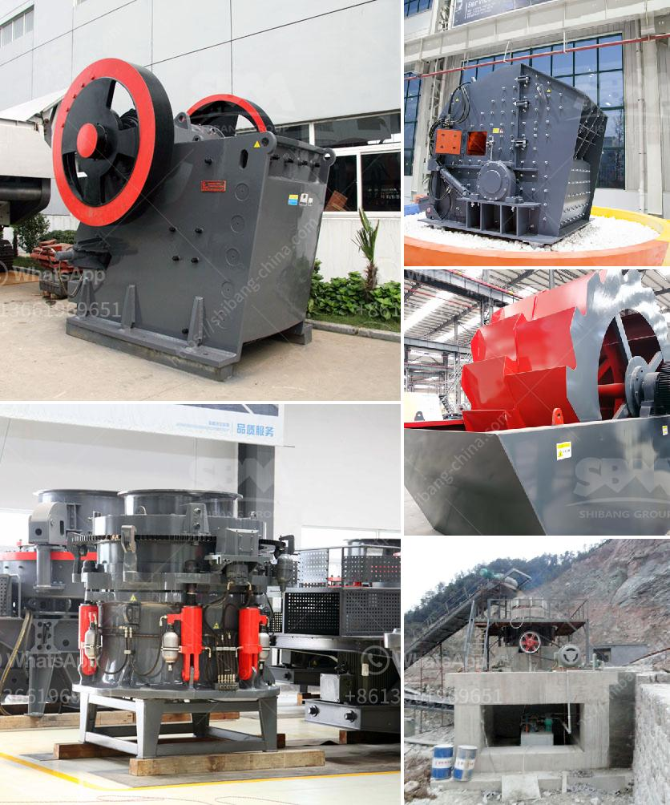

<h3>vibrating feeder vs belt conveyor</h3>
In various industries, such as mining, cement, and food processing, a vibrating feeder versus a belt conveyor is a common choice. What factors should you consider when deciding between the two? This article aims to compare and contrast the characteristics of vibrating feeders and belt conveyors to help you make an informed decision.

First, let's understand what a vibrating feeder and a belt conveyor are and how they work. A vibrating feeder is a device used to move materials along a production line or process. It uses vibration and gravity to transport materials, reducing manual handling and improving efficiency. On the other hand, a belt conveyor is a system made up of two or more pulleys, with a continuous loop of material that rotates around them, allowing for the transportation of materials over long distances.

One significant advantage of a vibrating feeder is its ability to handle a wide range of materials. Whether it's powdery, granular, or even sticky materials, a vibrating feeder can transport them effectively. This versatility makes it suitable for industries dealing with different types of materials regularly. In contrast, a belt conveyor performs better with larger and heavy materials. It provides stability and strength when transporting bulky items, making it more suitable for industries like mining and construction.

Another aspect worth considering is the level of control required over material flow. A vibrating feeder offers precise control over material flow. It can adjust the feed rate, ensuring optimal production rates and preventing material jams. This level of control allows for a smooth and continuous flow of materials. On the other hand, a belt conveyor may not provide the same level of control as its operation primarily depends on external factors like the speed of the pulleys and the load capacity. This lack of control may result in uneven material flow or even material spillage if not monitored carefully.

While a vibrating feeder might have advantages in terms of material handling and control, one area where a belt conveyor shines is transportation efficiency. Belt conveyors can transport large quantities of materials over long distances with minimal energy consumption, making them ideal for industries that require extensive material movement. In contrast, a vibrating feeder may not be as efficient in transporting materials over long distances, especially when dealing with heavy loads.

Noise and maintenance requirements are two additional factors to consider. A vibrating feeder generally produces less noise compared to a belt conveyor. Therefore, if reducing noise pollution is a priority, a vibrating feeder may be the better option. In terms of maintenance, both types of equipment require regular inspection and cleaning. However, a belt conveyor may require more maintenance due to its moving parts, including pulleys, belts, and bearings. Vibrating feeders, on the other hand, usually have fewer moving parts and are simpler to maintain.

In conclusion, the choice between a vibrating feeder and a belt conveyor depends on several factors. Consider the type of materials you handle, the level of control required, transportation efficiency, and maintenance needs. By assessing these factors, you can make an informed decision that will boost the efficiency and productivity of your operations.
<h3>Contact us</h3><ul><li><strong>Whatsapp:&nbsp;<a href="https://wa.me/8613661969651">+8613661969651</a></strong></li><li><a href="https://swt.shibang-china.com/?git&amp;zhl&amp;vibrating feeder vs belt conveyor"><strong>Online Service(chat now)</strong></a></li></ul><h3>Related</h3><ul><li><a href='crusher hydroponic cone crusher.md'>crusher hydroponic cone crusher</a></li><li><a href='cone crusher for sale nigeria.md'>cone crusher for sale nigeria</a></li><li><a href='crushing plant design and layout considerations.md'>crushing plant design and layout considerations</a></li><li><a href='rock salt mining open pit feasibility study.md'>rock salt mining open pit feasibility study</a></li><li><a href='portable stone crusher philippines.md'>portable stone crusher philippines</a></li></ul>