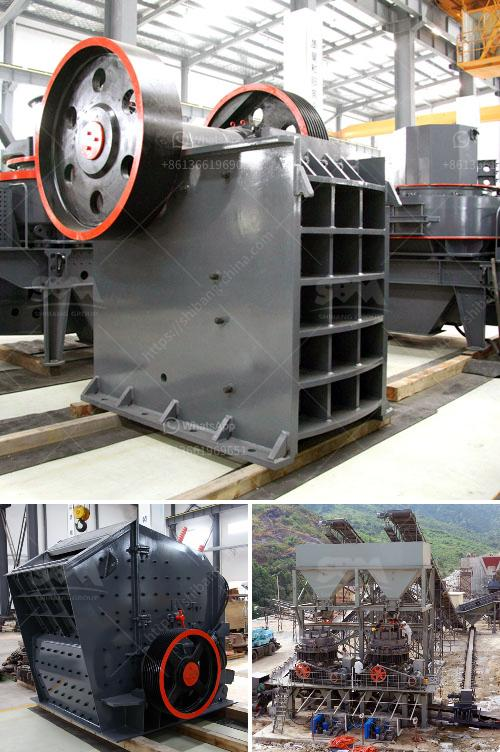

<h3>vibrating feeder zsw parts</h3>
The vibrating feeder is an essential equipment in the mining and construction industries. It is used to feed bulk material into crushers, screens, and other machines for efficient and continuous operations. One of the key components of a vibrating feeder is its parts, specifically those made for the ZSW series machines. These parts play a crucial role in ensuring the smooth and reliable functioning of the vibrating feeder.

One of the primary parts of a ZSW vibrating feeder is the vibrating motor. This motor is responsible for generating the vibrations that enable the feeder to move materials along the conveyor belt. It is crucial to choose a high-quality vibrating motor that is capable of producing strong and consistent vibrations. This ensures that the materials are evenly distributed, preventing any clogging or jamming in the feeder.

Another essential component of the ZSW vibrating feeder is the feeder trough. The trough is designed to hold the bulk material and guide it towards the crusher or screen. It must be robust and durable to withstand the constant movement and impact of the materials. Moreover, the trough must have a suitable design to prevent material spillage and ensure an efficient flow.

Additionally, the feeder springs and rubber buffers are crucial parts of the vibrating feeder. These components help absorb shocks and vibrations that occur during the feeding process. By reducing the impact on the feeder and other connected machinery, the springs and buffers enhance the overall lifespan of the equipment.

The feeder plate is another crucial part of the ZSW vibrating feeder. It assists in regulating the flow of materials onto the conveyor belt, preventing overloading and ensuring even distribution. The feeder plate is typically made from high-quality steel, offering excellent resistance to wear and tear.

Proper maintenance of the vibrating feeder parts is essential to maximize their lifespan and ensure reliable operations. Regular inspection, cleaning, and lubrication can help prevent excessive wear and tear. Any damaged or worn-out parts should be replaced promptly to avoid potential breakdowns.

When selecting parts for a ZSW vibrating feeder, it is essential to choose reputable suppliers who offer high-quality components. Inferior parts may result in a shorter lifespan of the equipment and constant repairs. It is also essential to ensure that the parts align with the specific requirements of the feeder model to guarantee compatibility and optimal performance.

In conclusion, the vibrating feeder ZSW parts are vital for the efficient and continuous operations of the feeder. From the vibrating motor and feeder trough to the springs and buffers, each component plays a crucial role in ensuring smooth material flow and preventing breakdowns. Proper maintenance and the selection of high-quality parts are key to maximizing the lifespan and performance of the vibrating feeder. By investing in reliable parts, operators can minimize maintenance costs, reduce downtime, and enhance overall productivity in mining and construction operations.
<h3>Contact us</h3><ul><li><strong>Whatsapp:&nbsp;<a href="https://wa.me/8613661969651">+8613661969651</a></strong></li><li><a href="https://swt.shibang-china.com/?git&amp;zhl&amp;vibrating feeder zsw parts"><strong>Online Service(chat now)</strong></a></li></ul><h3>Related</h3><ul><li><a href='clay crusher processing in india.md'>clay crusher processing in india</a></li><li><a href='slag powder grinding in india.md'>slag powder grinding in india</a></li><li><a href='pe 200 x 300 stone crusher.md'>pe 200 x 300 stone crusher</a></li><li><a href='portable sand washing machine.md'>portable sand washing machine</a></li><li><a href='roller mill famsun.md'>roller mill famsun</a></li></ul>