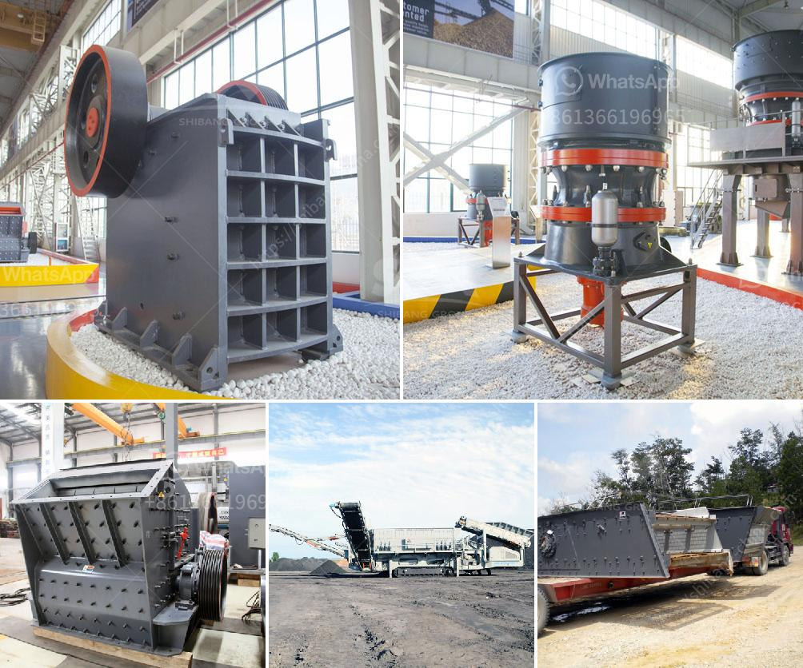

<h3>vibrating screen design products from philippines</h3>
Vibrating screens are used in many different industries to separate and size various particles and materials. Vibrating screen design products from the Philippines offer a wide range of options to meet the different needs of various industries. These products include:

1. Vibrating screens for mining: Different mining operations require different sizes and types of vibrating screens. These screens are efficient and cost-effective for the separation and sizing of minerals, coal, ores, and quarry aggregates. They can be used in both wet and dry applications and can handle high volumes of material.

2. Vibrating screens for construction: The construction industry often requires the separation and sizing of different aggregates for various applications, such as mixing concrete, asphalt production, and road construction. The vibrating screens designed for construction sites are portable and easy to move, making them ideal for on-site operations.

3. Vibrating screens for food processing: The food processing industry requires sanitary and hygienic equipment to ensure the safety of the products. Vibrating screens designed for food processing are built with easy-to-clean surfaces and can be disassembled without tools for thorough cleaning. They are used for separating and grading food ingredients, such as flour, sugar, spices, and grains.

4. Vibrating screens for pharmaceuticals: In the pharmaceutical industry, the separation and sizing of powders and granules are critical for precise dosage forms. Vibrating screens designed for pharmaceutical applications are made of high-quality stainless steel with minimal crevices to prevent contamination. They can handle fine particles and are often used for quality control and product inspection.

5. Vibrating screens for recycling: Recycling facilities require efficient separation equipment to sort different types of materials, such as plastics, glass, metals, and paper. Vibrating screens designed for recycling are versatile and can handle a wide range of materials. They help separate different particle sizes and remove impurities for further processing.

6. Vibrating screens for agriculture: The agriculture industry utilizes vibrating screens for various applications, including seed cleaning and grading, crop sorting, and animal feed separation. These screens are designed to handle large volumes of agricultural materials and can be customized to suit specific farming operations.

7. Vibrating screens for wastewater treatment: The treatment of wastewater requires the removal of solids and contaminants to ensure clean water is returned to the environment. Vibrating screens designed for wastewater treatment can efficiently remove large solids, such as plastic debris, rags, and vegetation. They are essential equipment in wastewater treatment plants to prevent clogging and optimize the treatment process.

Vibrating screen design products from the Philippines are known for their durability, reliability, and high performance. The manufacturers in the Philippines understand the evolving needs of various industries and provide products designed to meet the specific requirements. These designs are continuously improved and refined to ensure optimal performance and customer satisfaction.

In conclusion, vibrating screen design products from the Philippines offer a wide range of options to meet the diverse needs of different industries. From mining and construction to food processing and recycling, these screens are designed to efficiently separate and size various materials. The manufacturers in the Philippines prioritize quality and provide reliable equipment that helps industries optimize their operations.
<h3>Contact us</h3><ul><li><strong>Whatsapp:&nbsp;<a href="https://wa.me/8613661969651">+8613661969651</a></strong></li><li><a href="https://swt.shibang-china.com/?git&amp;zhl&amp;vibrating screen design products from philippines"><strong>Online Service(chat now)</strong></a></li></ul><h3>Related</h3><ul><li><a href='differences between hammer mill and ball mill.md'>differences between hammer mill and ball mill</a></li><li><a href='stone for stone mill.md'>stone for stone mill</a></li><li><a href='hammer for crushing concrete.md'>hammer for crushing concrete</a></li><li><a href='gold wash plant manufacturer in india.md'>gold wash plant manufacturer in india</a></li><li><a href='zambia mining conveyor belt.md'>zambia mining conveyor belt</a></li></ul>