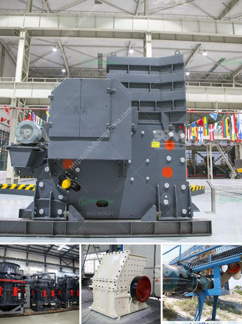

<h3>vibrating screen indonesia</h3>
Vibrating screens are a vital tool in many industries, particularly in the mineral processing industry. Their ability to separate particles makes them an essential piece of equipment in different industries, including those in Indonesia. As the demand for high-quality products rises and the need for efficient processing increases, vibrating screens have become increasingly popular in various Indonesian industries.

Indonesia is a country rich in natural resources, with a vast variety of minerals that require processing. Vibrating screens play an important role in mineral processing applications as they separate valuable minerals from the unwanted ones. Their versatility and efficiency make them the ideal choice for processing various types of minerals, including coal, iron ore, gold, and limestone.

One of the key advantages of vibrating screens is their ability to handle a large capacity of material flows. This is especially important in Indonesia, where many mining operations operate on a large scale. Vibrating screens can efficiently process large quantities of material, ensuring continuous and uninterrupted production.

Additionally, vibrating screens in Indonesia are capable of separating different sizes of materials. This is essential in the mineral processing industry, as particles are often required to be categorized based on their size. The ability to separate materials according to size ensures that only the desired particles are processed further, increasing efficiency and reducing waste.

Another crucial aspect of vibrating screens in Indonesia is their ability to handle various types of materials. Indonesia has a diverse range of minerals, each with its specific characteristics. Vibrating screens are designed to handle different types of materials, whether they are wet or dry, coarse or fine. This versatility is important in ensuring efficient and effective processing of minerals.

In recent years, vibrating screens in Indonesia have undergone technological advancements to improve their performance and reliability. These advancements include innovations such as improved screen decks, enhanced motion characteristics, and better control systems. These advancements have led to increased efficiency, higher production rates, and reduced downtime, making vibrating screens even more valuable in the Indonesian mineral processing industry.

Manufacturers in Indonesia have recognized the importance of vibrating screens, leading to the production of high-quality screens that meet the specific requirements of Indonesian industries. These manufacturers employ advanced manufacturing techniques and quality control measures to produce screens that are durable, reliable, and efficient.

In conclusion, vibrating screens play a significant role in the mineral processing industry in Indonesia. With their ability to handle large capacities, separate materials based on size, and process various types of minerals, they are an essential tool in many Indonesian industries. The technological advancements and high-quality screens produced by manufacturers in Indonesia further enhance the efficiency and effectiveness of vibrating screens in the country. As the demand for mineral processing continues to grow in Indonesia, the importance of vibrating screens will only increase.
<h3>Contact us</h3><ul><li><strong>Whatsapp:&nbsp;<a href="https://wa.me/8613661969651">+8613661969651</a></strong></li><li><a href="https://swt.shibang-china.com/?git&amp;zhl&amp;vibrating screen indonesia"><strong>Online Service(chat now)</strong></a></li></ul><h3>Related</h3><ul><li><a href='limestone grinding machine manufacturers in india.md'>limestone grinding machine manufacturers in india</a></li><li><a href='how much do rock crushers cost.md'>how much do rock crushers cost</a></li><li><a href='stone crusher to diessel.md'>stone crusher to diessel</a></li><li><a href='alluvial chrome wash plant in zimbabwe.md'>alluvial chrome wash plant in zimbabwe</a></li><li><a href='rock crusher machine for sale.md'>rock crusher machine for sale</a></li></ul>