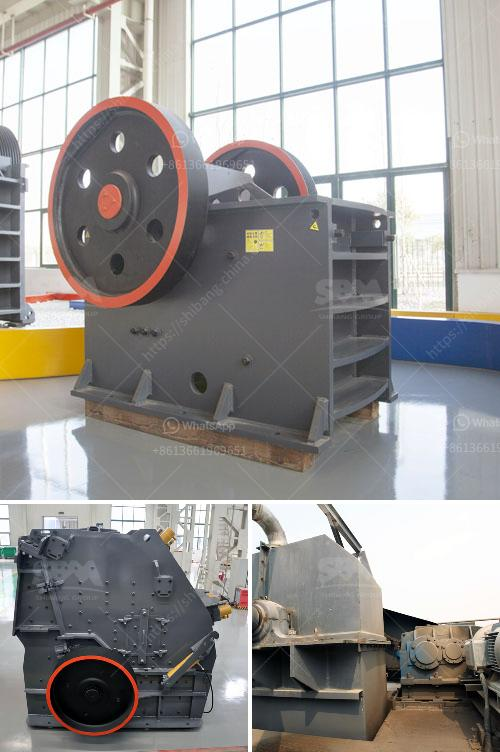

<h3>vibrating screen size 1mm</h3>
Vibrating screens are versatile equipment used in various industries to separate different sizes of particles or materials. One such type is the vibrating screen with a 1mm size mesh or sieve. This particular screen size is commonly used for sifting or sieving fine particles, including powders and granules.

The 1mm vibrating screen is designed with a mesh or sieve that consists of evenly spaced wires or perforated plates with openings of 1mm in diameter. As the screen vibrates, the particles or materials with a size less than or equal to 1mm efficiently pass through the sieve, while larger particles are retained.

One of the key advantages of using a vibrating screen with a 1mm size mesh is its ability to efficiently separate fine particles. This is crucial in industries such as pharmaceuticals, chemicals, food processing, and mining, where the accurate classification and separation of particles are important. The 1mm size range is ideal for separating materials into different fractions, ensuring the desired quality and consistency of the final product.

In pharmaceutical manufacturing, for example, vibrating screens with a 1mm mesh are used to separate active ingredients or drug substances from excipients or non-active substances. This ensures that only the desired particle size range of the active ingredient is present in the final dosage form, promoting efficacy and minimizing any potential adverse effects.

The 1mm vibrating screen is also widely used in the mining industry for the separation of valuable minerals from gangue or waste materials. The screen's precise sieving capability allows for efficient sorting or grading of particles based on their size, ensuring that only valuable minerals of the desired size range are further processed.

Overall, the vibrating screen with a 1mm size mesh is a valuable tool in industries where accurate particle size separation is crucial. Its efficiency and effectiveness in separating fine particles make it an essential equipment for a wide range of applications, ensuring high-quality products and optimal production processes.
<h3>Contact us</h3><ul><li><strong>Whatsapp:&nbsp;<a href="https://wa.me/8613661969651">+8613661969651</a></strong></li><li><a href="https://swt.shibang-china.com/?git&amp;zhl&amp;vibrating screen size 1mm"><strong>Online Service(chat now)</strong></a></li></ul><h3>Related</h3><ul><li><a href='mining ball mill.md'>mining ball mill</a></li><li><a href='sand and gravel mining equipment for sale.md'>sand and gravel mining equipment for sale</a></li><li><a href='benefits of vsi crusher.md'>benefits of vsi crusher</a></li><li><a href='jaw crusher ghana quarry plant.md'>jaw crusher ghana quarry plant</a></li><li><a href='silica sand refind machines in germany.md'>silica sand refind machines in germany</a></li></ul>