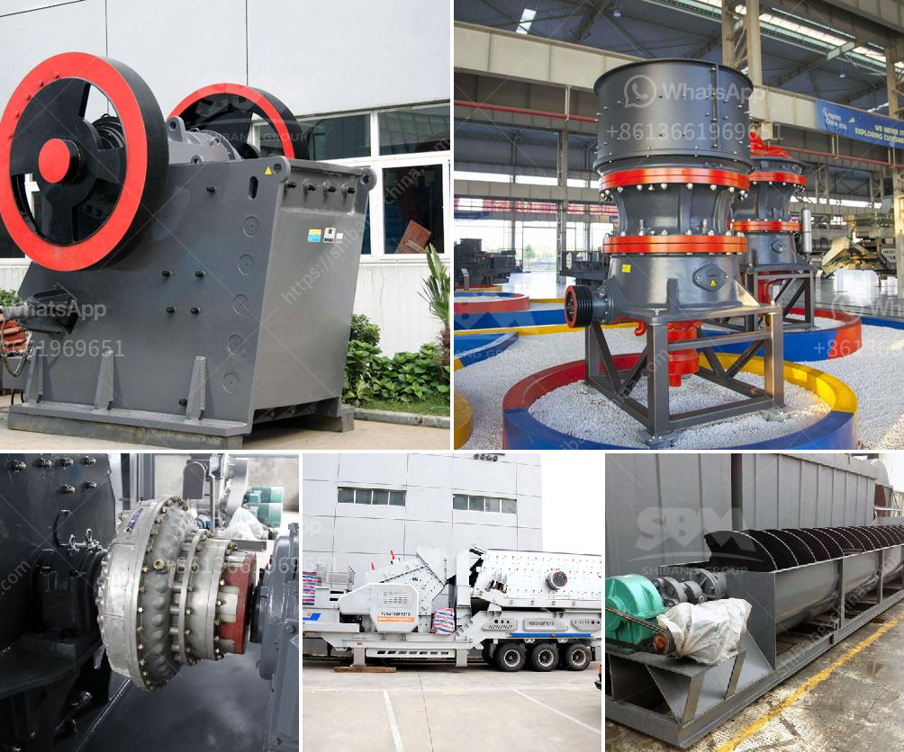

<h3>vibrating screen size decision</h3>
When choosing the right vibrating screen size for your application, there are several factors to consider. The size of the screen will directly affect the screening efficiency and production capacity of the equipment, so it is crucial to make the right decision.

Firstly, you need to assess the nature of the material you will be screening. Different materials have varying characteristics, such as particle size, shape, moisture content, and density. These properties will influence the choice of screen size. For example, if you are dealing with fine particles, a smaller mesh size will be more suitable to efficiently separate and classify them.

Secondly, consider the desired production capacity. The size of the screen will affect the efficiency of material throughput. A larger screen size means more material can be processed at once, increasing production capacity. However, it is important to strike a balance and avoid selecting an overly large screen size that may lead to inefficient screening or excessive energy consumption.

Additionally, the type of screen deck also plays a role in determining the ideal screen size. There are various types of screen decks available, such as woven wire mesh, perforated plates, and polyurethane panels. Each deck type may have specific limitations or advantages regarding size options, so it is important to consult with experts or manufacturers to determine the best choice for your application.

Lastly, consider the equipment and space constraints in your facility. If you have limited space, choosing a smaller vibrating screen size may be necessary to fit within the available area. It is essential to ensure that the equipment is properly installed with enough clearance to allow for maintenance and easy adjustment.

In conclusion, choosing the right vibrating screen size for your application requires careful evaluation of the material properties, desired production capacity, screen deck type, and equipment constraints. Consulting with industry experts and manufacturers can greatly assist in making an informed decision. Taking these factors into account will help ensure optimal screening efficiency and productivity for your operations.
<h3>Contact us</h3><ul><li><strong>Whatsapp:&nbsp;<a href="https://wa.me/8613661969651">+8613661969651</a></strong></li><li><a href="https://swt.shibang-china.com/?git&amp;zhl&amp;vibrating screen size decision"><strong>Online Service(chat now)</strong></a></li></ul><h3>Related</h3><ul><li><a href='stone jaw crushers in japan.md'>stone jaw crushers in japan</a></li><li><a href='30 tons per hour washing plant gold.md'>30 tons per hour washing plant gold</a></li><li><a href='talcum powder bp usp manufacturers in india.md'>talcum powder bp usp manufacturers in india</a></li><li><a href='basalt manufacturing plant.md'>basalt manufacturing plant</a></li><li><a href='pe 200 x 300 stone crusher.md'>pe 200 x 300 stone crusher</a></li></ul>