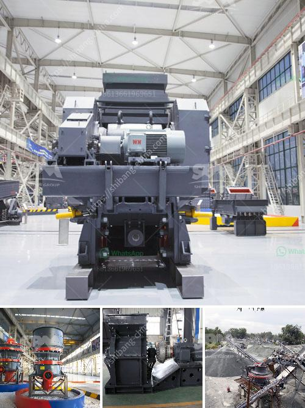

<h3>vibrating screen supplier philippines</h3>
When it comes to industrial machinery, it is crucial to partner with a reliable supplier. This is especially true for vibrating screens, which are widely used in various industries such as mining, construction, and recycling. A vibrating screen is an essential tool in the production process, as it separates the desired material from unwanted particles. Therefore, choosing a reputable vibrating screen supplier in the Philippines is vital for ensuring optimal performance and efficiency in your operations.

One of the key factors to consider when selecting a vibrating screen supplier is their experience and expertise in the industry. An established supplier with years of experience is more likely to have a thorough understanding of the technology involved in producing high-quality vibrating screens. They would have already honed their manufacturing processes and perfected their design to deliver reliable and efficient products to their customers.

In addition to experience, it is important to choose a supplier that offers a wide range of vibrating screens to cater to different requirements. Different industries have distinct needs, and a supplier that offers a diverse selection of vibrating screens can provide customized solutions. Whether you need a circular, linear, or high-frequency vibrating screen, a reliable supplier should be able to offer a variety of options to meet your specific demands.

Another crucial aspect to consider is the quality of the vibrating screens offered by the supplier. High-quality materials and components should be used in the construction of these machines to ensure durability and longevity. A reputable supplier should be transparent about the materials used in their vibrating screens and should be able to provide certifications or evidence of quality assurance processes.

Furthermore, it is essential to assess the after-sales service provided by the vibrating screen supplier. A reliable supplier should offer prompt and efficient technical support, including maintenance, repairs, and spare parts availability. This ensures that your vibrating screens will be properly maintained and any issues can be quickly addressed, minimizing downtime and maximizing productivity.

When searching for a vibrating screen supplier in the Philippines, it is also recommended to check customer reviews and testimonials. The experiences of other customers can provide valuable insights into a supplier's reliability and the quality of their products and services. Positive feedback from satisfied customers is a good indicator that you can trust the supplier to deliver on their promises.

Lastly, it is necessary to consider the price and overall value offered by the vibrating screen supplier. While it is important to compare prices, it is crucial not to compromise on quality. Opting for a cheap but inferior vibrating screen can result in frequent breakdowns and costly repairs in the long run. Instead, look for a supplier that offers competitive pricing without sacrificing quality.

In conclusion, choosing a reliable vibrating screen supplier in the Philippines is vital for ensuring the success of your industrial operations. By considering factors such as experience, product range, quality, after-sales service, customer feedback, and pricing, you can find a supplier that offers high-quality vibrating screens that meet your specific needs. Remember, investing in a trustworthy supplier will pay off in the form of increased productivity, efficiency, and overall operational excellence.
<h3>Contact us</h3><ul><li><strong>Whatsapp:&nbsp;<a href="https://wa.me/8613661969651">+8613661969651</a></strong></li><li><a href="https://swt.shibang-china.com/?git&amp;zhl&amp;vibrating screen supplier philippines"><strong>Online Service(chat now)</strong></a></li></ul><h3>Related</h3><ul><li><a href='advantages and disadvantages of a roll crusher.md'>advantages and disadvantages of a roll crusher</a></li><li><a href='desain conveyor belt di tambang batu bara.md'>desain conveyor belt di tambang batu bara</a></li><li><a href='price conveyor belt price.md'>price conveyor belt price</a></li><li><a href='type of quarry crusher equipment.md'>type of quarry crusher equipment</a></li><li><a href='buy gold crusher machine.md'>buy gold crusher machine</a></li></ul>