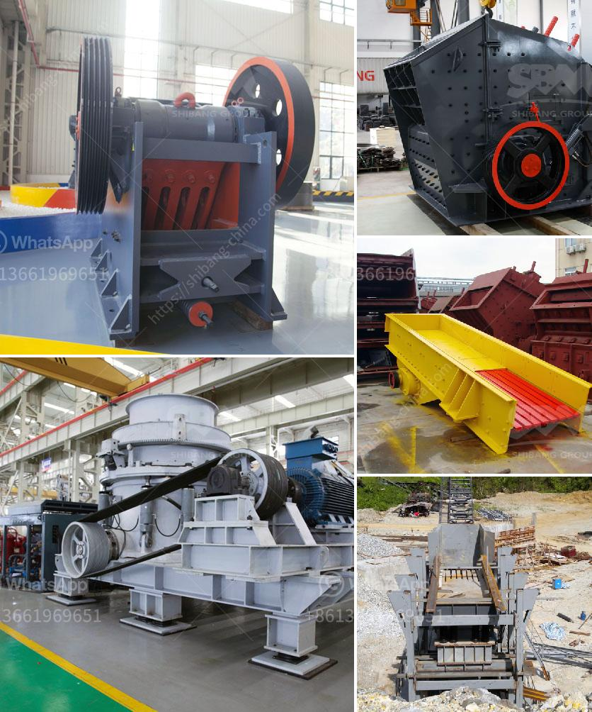

<h3>vibrating screen suppliers in philippines</h3>
Vibrating screens are essential equipment in many industries, particularly in the mining and construction sectors. The Philippines is a country rich in natural resources, making it a prime location for various mining operations. However, vibrating screens play a crucial role in ensuring efficient and effective separation and classification of materials, ensuring smooth and uninterrupted operations.

In recent years, the demand for vibrating screens in the Philippines has increased significantly. As a result, numerous suppliers have emerged in the market, providing a wide range of options for businesses and industries seeking this equipment. These suppliers offer different types of vibrating screens, including circular vibrating screens, linear vibrating screens, and high-frequency vibrating screens, among others.

One prominent supplier in the Philippines is [Company Name]. They have established themselves as a reliable supplier, providing high-quality vibrating screens that meet the specific needs and requirements of their customers. With years of experience and expertise in the industry, they understand the importance of providing efficient, durable, and cost-effective solutions.

Another reputable supplier is [Company Name]. They specialize in supplying a wide range of vibrating screens, including equipment for heavy-duty applications. Their vibrating screens are known for their reliability and long service life, making them the preferred choice for many businesses in the mining and construction sectors.

When choosing a vibrating screen supplier in the Philippines, it is essential to consider factors such as product quality, customer support, and after-sales service. A reliable supplier should have a track record of delivering high-quality products and providing excellent customer service. They should also offer technical support and assistance to ensure that their customers can make the most out of their vibrating screens.

To sum up, vibrating screens are crucial equipment for various industries in the Philippines. With the increasing demand for this equipment, numerous suppliers have emerged in the market. However, it is important to choose a reputable supplier that can deliver high-quality products and excellent customer service. By choosing the right supplier, businesses and industries can ensure efficient and uninterrupted operations, leading to increased productivity and profitability.
<h3>Contact us</h3><ul><li><strong>Whatsapp:&nbsp;<a href="https://wa.me/8613661969651">+8613661969651</a></strong></li><li><a href="https://swt.shibang-china.com/?git&amp;zhl&amp;vibrating screen suppliers in philippines"><strong>Online Service(chat now)</strong></a></li></ul><h3>Related</h3><ul><li><a href='cost of setting up quarry plant in nigeria.md'>cost of setting up quarry plant in nigeria</a></li><li><a href='dolomite crusher machine plant.md'>dolomite crusher machine plant</a></li><li><a href='how to calculate the operating cost of a stone crusher.md'>how to calculate the operating cost of a stone crusher</a></li><li><a href='latest three roll mills.md'>latest three roll mills</a></li><li><a href='mobile crushers for sale.md'>mobile crushers for sale</a></li></ul>