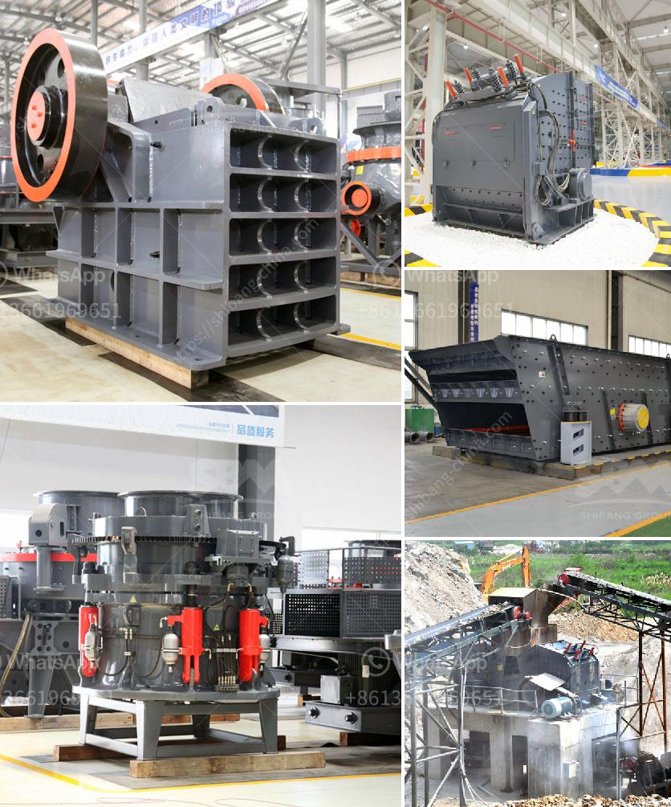

<h3>vibro screen machine in ahmedabad</h3>
The city of Ahmedabad, located in the vibrant state of Gujarat, India, has emerged as a major industrial hub in recent years. With its favorable business environment, state-of-the-art infrastructure, and skilled workforce, Ahmedabad has become a hotspot for various industries, including manufacturing. One such industry that has witnessed tremendous growth in Ahmedabad is the screening and sieving industry, with the introduction of innovative vibro screen machines.

Vibro screen machines, also known as vibrating screens or gyratory screens, are efficient screening solutions that are widely used in various industries to separate solids from liquids or segregate materials of different sizes. These machines utilize vibrations to separate and classify materials based on their particle size, ensuring a high level of accuracy and efficiency.

Ahmedabad has emerged as a key manufacturing hub for vibro screen machines, with several prominent manufacturers and suppliers catering to the increasing demand. These machines are designed and manufactured using advanced technology and high-quality materials to ensure durability, reliability, and optimal performance.

One of the key advantages of vibro screen machines is their versatility and wide range of applications. They can be used for a variety of screening operations, including scalping, classifying, dewatering, and removing impurities. In industries such as pharmaceuticals, chemicals, food processing, and minerals, vibro screen machines play a crucial role in ensuring product quality and enhancing production efficiency.

The vibro screen machines manufactured in Ahmedabad are known for their robust construction, user-friendly design, and low maintenance requirements. These machines are built to withstand heavy usage and can efficiently handle large volumes of materials. Moreover, they offer seamless operation, with adjustable settings to meet different screening requirements.

In addition to their efficiency and durability, vibro screen machines are known for their energy efficiency. They consume less power compared to traditional screening machines, making them environmentally friendly and cost-effective. The low power consumption of these machines also helps in reducing overall operational costs for businesses.

Manufacturers in Ahmedabad ensure that their vibro screen machines comply with industry standards and regulations. They undergo rigorous testing and quality checks to guarantee superior performance and adherence to safety norms. Additionally, these machines are available in different sizes and configurations to cater to the varied needs of different industries.

As the demand for efficient screening solutions continues to grow in Ahmedabad and beyond, the local market for vibro screen machines is set to thrive. With increasing awareness about the benefits of these machines, industries are increasingly adopting them to enhance their production processes and ensure product quality. The availability of reliable suppliers and manufacturers in Ahmedabad makes it convenient for businesses to acquire high-quality vibro screen machines without any hassle.

In conclusion, the advent of vibro screen machines in Ahmedabad has revolutionized the screening and sieving industry. With their efficiency, versatility, and low maintenance requirements, these machines have become an integral part of several industries. As the demand for these machines continues to rise, Ahmedabad is poised to maintain its leadership position as a manufacturing hub for vibro screen machines, contributing to the overall growth and development of the city's industrial sector.
<h3>Contact us</h3><ul><li><strong>Whatsapp:&nbsp;<a href="https://wa.me/8613661969651">+8613661969651</a></strong></li><li><a href="https://swt.shibang-china.com/?git&amp;zhl&amp;vibro screen machine in ahmedabad"><strong>Online Service(chat now)</strong></a></li></ul><h3>Related</h3><ul><li><a href='materials for zenith jaw crusher in europe.md'>materials for zenith jaw crusher in europe</a></li><li><a href='crusher machine suppliers.md'>crusher machine suppliers</a></li><li><a href='raymond mill india.md'>raymond mill india</a></li><li><a href='quartz grinding pulveriser single phase.md'>quartz grinding pulveriser single phase</a></li><li><a href='jaw crusher manufacturer germany.md'>jaw crusher manufacturer germany</a></li></ul>