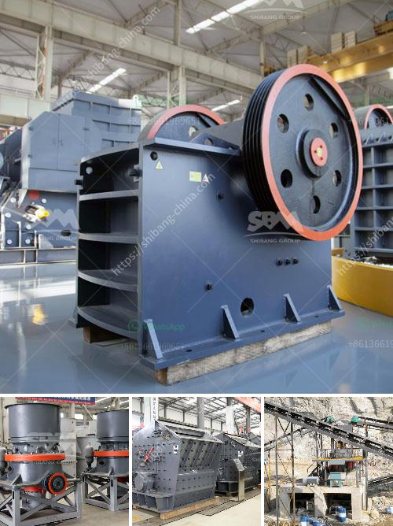

<h3>vrm vertical roller mill</h3>
The cement industry has been undertaking remarkable technological advancements in recent years. With the aim of meeting the ever-increasing demands of the market, cement manufacturers are constantly seeking innovative solutions to enhance their production processes. One such groundbreaking technology that has gained significant traction in the industry is the VRM Vertical Roller Mill.

The VRM Vertical Roller Mill is an energy-efficient grinding mill that combines the advantages of a conventional ball mill with various new technologies. It uses compressed air to grind raw materials such as limestone, clinker, and coal into powdered form. With consistent and precise grinding action, the VRM Vertical Roller Mill produces superior-quality cement with high fineness.

One of the standout advantages of the VRM Vertical Roller Mill is its ability to grind materials with high efficiency. The mill's unique design allows it to achieve grinding efficiencies of up to 30% more compared to traditional ball mills. This is mainly due to its advanced grinding mechanism, which reduces energy consumption while ensuring a uniform and consistent grind.

The VRM Vertical Roller Mill also offers significant environmental benefits. Its low noise and vibration levels make it a highly desirable option for noise-sensitive environments. Additionally, the mill's high dust collection efficiency minimizes dust emissions, thereby contributing to a greener and more sustainable cement production process. Furthermore, the VRM Vertical Roller Mill requires less water for operation, resulting in decreased water consumption and improved water management in cement plants.

Another remarkable feature of the VRM Vertical Roller Mill is its versatility. It is capable of grinding various materials, including not only cement clinker but also minerals such as limestone, dolomite, and gypsum. This flexibility enables cement manufacturers to produce a wide range of products, catering to different construction requirements.

In terms of maintenance and operation, the VRM Vertical Roller Mill offers several advantages over conventional ball mills. Its compact design and simplified maintenance procedures make it easier to install and maintain, reducing downtime and enhancing overall plant productivity. Additionally, the mill's advanced control systems ensure precise and optimal performance, resulting in consistent product quality.

Several cement manufacturers worldwide have already embraced the use of VRM Vertical Roller Mills in their operations. Not only have they witnessed substantial improvements in their production efficiency, but they have also experienced significant cost savings. The lower energy consumption and maintenance requirements of the VRM Vertical Roller Mill translate to reduced operational expenses, allowing companies to achieve long-term profitability.

In conclusion, the VRM Vertical Roller Mill is undoubtedly a revolutionary technology in the cement grinding industry. Its ability to produce superior-quality cement with high efficiency, its environmental benefits, and its versatility make it an attractive option for cement manufacturers worldwide. By adopting the VRM Vertical Roller Mill, companies can pave the way for a more sustainable and profitable future in cement production.
<h3>Contact us</h3><ul><li><strong>Whatsapp:&nbsp;<a href="https://wa.me/8613661969651">+8613661969651</a></strong></li><li><a href="https://swt.shibang-china.com/?git&amp;zhl&amp;vrm vertical roller mill"><strong>Online Service(chat now)</strong></a></li></ul><h3>Related</h3><ul><li><a href='alluvial diamond processing plant container for sale.md'>alluvial diamond processing plant container for sale</a></li><li><a href='small stone crusher machine in italy.md'>small stone crusher machine in italy</a></li><li><a href='gold mining machinery.md'>gold mining machinery</a></li><li><a href='concrete crusher for rent in toronto.md'>concrete crusher for rent in toronto</a></li><li><a href='marble powder mill.md'>marble powder mill</a></li></ul>