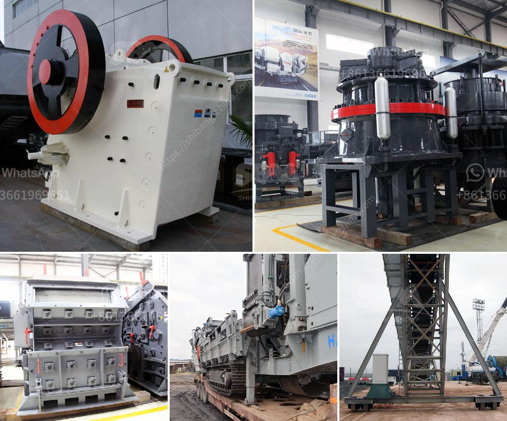

<h3>vsi crusher for 100tph output per hour</h3>
The VSI crusher, also known as the vertical shaft impact crusher, is a crusher that uses a high-speed rotating rotor to impart an impact force on materials. It mainly consists of a hopper, a distributor, a vortex crushing chamber, an impeller, a main shaft, a base, a transmission device, and a motor. The VSI crusher is an ideal choice for producing high-quality sand and aggregates for various construction applications.

When it comes to the VSI crusher's output capacity, it is commonly measured in tons per hour. A 100-tph VSI crusher is typically designed to produce 1"-3" sand and aggregate. The crusher's capacity can be influenced by several factors, including the feed size, feed rate, rotor speed, and particle shape requirements.

The feed size of the VSI crusher plays a crucial role in determining its output capacity. A smaller feed size allows for better particle shape and higher production efficiency. Hence, the VSI crusher is often used in the final crushing stage to produce fine and cubic-shaped aggregates.

The feed rate refers to the amount of material fed into the crusher per hour. A higher feed rate generally results in higher production output. However, it is essential to strike a balance between the feed rate and the crusher's capacity to ensure optimal performance and prevent overloading.

The rotor speed of the VSI crusher affects the crushing efficiency and the amount of material processed per hour. A higher rotor speed generally leads to finer crushing and higher production capacity. However, a high rotor speed may also increase energy consumption and wear on the rotor and other components.

The VSI crusher excels in shaping the final product's particle shape. The high-speed rotating rotor generates significant impact forces, which help to create angular and cubical particles. Compared to other crushing equipment, the VSI crusher produces a higher percentage of excellent particle shapes, making it suitable for applications that require superior aesthetics and performance.

In conclusion, the VSI crusher is a versatile and efficient crushing machine that can produce high-quality sand and aggregates for various construction applications. When considering a 100-tph VSI crusher's output capacity, factors such as feed size, feed rate, rotor speed, and particle shape requirements should be taken into account. These factors influence the crusher's performance and determine the amount of material processed per hour. With proper adjustments and optimization, the VSI crusher can deliver consistent and reliable production output while meeting the desired specifications for the final product.
<h3>Contact us</h3><ul><li><strong>Whatsapp:&nbsp;<a href="https://wa.me/8613661969651">+8613661969651</a></strong></li><li><a href="https://swt.shibang-china.com/?git&amp;zhl&amp;vsi crusher for 100tph output per hour"><strong>Online Service(chat now)</strong></a></li></ul><h3>Related</h3><ul><li><a href='serie dgs utiliza en piedra linea de produccion.md'>serie dgs utiliza en piedra linea de produccion</a></li><li><a href='stone crusher dubai for sale.md'>stone crusher dubai for sale</a></li><li><a href='jaw crusher manufacturer in china.md'>jaw crusher manufacturer in china</a></li><li><a href='gold stone crusher images.md'>gold stone crusher images</a></li><li><a href='pulverizer crusher machine manufacturers south africa.md'>pulverizer crusher machine manufacturers south africa</a></li></ul>