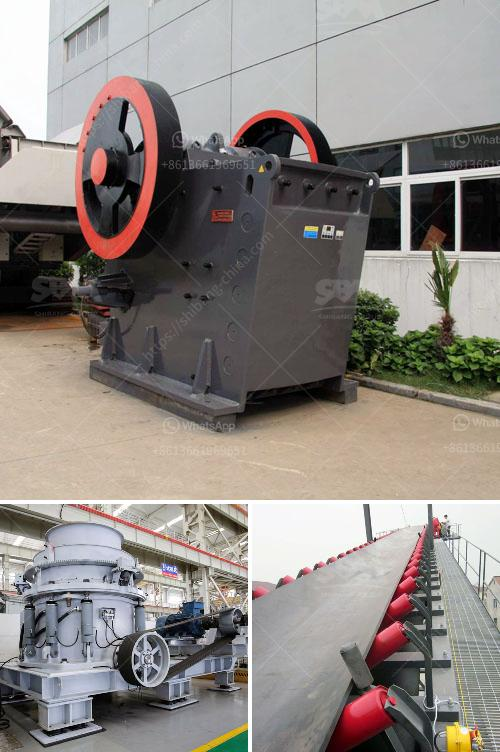

<h3>wet ground mica powder mill equipment supplier</h3>
Wet ground mica powder is a versatile material used in various industries for its unique properties. It is produced by grinding natural mica flakes with water and various additives, resulting in finely ground particles with a smooth texture. This powder is widely used in industries ranging from cosmetics and personal care to automotive and construction.

One crucial aspect of obtaining high-quality wet ground mica powder is the equipment used in the grinding process. Choosing a reliable and efficient supplier for this equipment is essential in ensuring the desired product quality. There are several factors to consider when selecting a supplier for wet ground mica powder mill equipment.

Firstly, it is crucial to assess the supplier's experience and expertise in manufacturing mica powder mill equipment. An experienced supplier is more likely to have a deep understanding of the grinding process and the specific requirements for producing wet ground mica powder. They are also more likely to have developed advanced technologies and techniques to optimize the equipment's performance.

Secondly, the supplier should offer a wide range of equipment options to cater to different production capacities and specific requirements. For instance, some industries may require larger-scale production, while others may have specific requirements for the particle size distribution of the mica powder. A supplier that offers a variety of equipment options allows for greater flexibility in adapting to specific production needs.

Furthermore, it is important to consider the supplier's reputation and track record. A reputable supplier will have a history of providing reliable and durable equipment that meets quality standards. It is advisable to seek recommendations or reviews from other industry professionals who have previously worked with the supplier. This will provide insights into the supplier's reliability and the performance of their equipment.

In addition to the equipment itself, the supplier should also provide comprehensive after-sales support. This includes technical assistance, maintenance services, and spare parts availability. Having a supplier that offers prompt and efficient after-sales support is crucial in minimizing downtime and ensuring uninterrupted production.

Lastly, it is essential to consider the supplier's commitment to sustainability. In today's environmentally conscious world, companies are increasingly seeking equipment suppliers that prioritize sustainability in their manufacturing processes. This may involve using eco-friendly materials, energy-saving technologies, or reducing waste generation. Choosing a supplier that aligns with sustainability practices can contribute to a company's overall environmental goals and reputation.

In conclusion, selecting a reliable and efficient supplier of wet ground mica powder mill equipment is vital for the production of high-quality mica powder. Factors such as experience, equipment options, reputation, after-sales support, and sustainability practices should be considered when making this decision. By carefully evaluating these aspects, companies can ensure the consistent production of wet ground mica powder that meets their specific requirements.
<h3>Contact us</h3><ul><li><strong>Whatsapp:&nbsp;<a href="https://wa.me/8613661969651">+8613661969651</a></strong></li><li><a href="https://swt.shibang-china.com/?git&amp;zhl&amp;wet ground mica powder mill equipment supplier"><strong>Online Service(chat now)</strong></a></li></ul><h3>Related</h3><ul><li><a href='process of raw mill.md'>process of raw mill</a></li><li><a href='sample of a business proposal for a block factory.md'>sample of a business proposal for a block factory</a></li><li><a href='cost of glass aggregate machines.md'>cost of glass aggregate machines</a></li><li><a href='used sand mining equipment sale.md'>used sand mining equipment sale</a></li><li><a href='jaw crusher grinding.md'>jaw crusher grinding</a></li></ul>