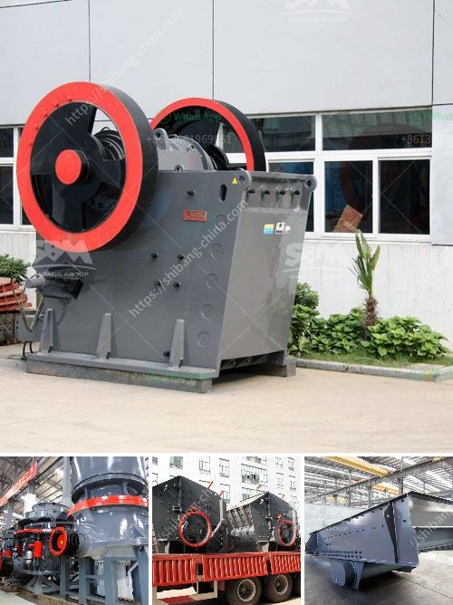

<h3>wet ultra fine fine grinding equipment</h3>
Wet ultrafine grinding equipment is a great solution for reducing particle size to meet the needs of various industries. The process of grinding involves using water or any other liquid as a medium to effectively break down particles and create a fine, uniform product.

One of the primary advantages of wet ultrafine grinding equipment is its ability to produce high-quality, fine particles. The liquid medium allows for better control over particle size distribution, resulting in a more uniform product. This is particularly important in industries such as pharmaceuticals, where precise particle size is necessary for optimal drug performance.

Another advantage of wet ultrafine grinding equipment is its versatility. It can handle a wide range of materials, from soft to hard and even abrasive substances. This makes it suitable for a variety of applications, including the production of paints, pigments, dyes, ceramics, and minerals.

The equipment used for wet ultrafine grinding typically consists of a horizontal or vertical stirred media mill. This mill contains grinding media, such as beads or balls, which are agitated by a rotating shaft. The liquid medium is continuously fed into the mill, ensuring efficient grinding and dispersion of the particles.

The wet grinding process offers several advantages over dry grinding. For one, it reduces dust emissions, which can be a safety hazard and create an undesirable working environment. Additionally, the presence of the liquid medium helps to control the temperature during grinding, preventing overheating and minimizing the risk of thermal damage to the product.

The choice of the grinding media is crucial for achieving the desired particle size and product quality. The selection is based on factors such as the material being processed, desired fineness, and the required production rate. Different types of grinding media, such as glass beads, ceramic beads, and steel balls, can be used depending on the specific requirements.

To ensure optimal performance and longevity of the equipment, proper maintenance is essential. Regular cleaning and inspection of the mill, as well as replacing worn or damaged parts, will help to extend its lifespan and prevent costly breakdowns. It is also important to use the appropriate lubricants to ensure smooth operation and reduce friction in the mill.

In conclusion, wet ultrafine grinding equipment is a valuable tool for various industries that require fine particle size reduction. Its ability to produce high-quality, uniform products and handle a wide range of materials makes it a versatile solution. With proper maintenance and care, this equipment can provide reliable and efficient performance for years to come.
<h3>Contact us</h3><ul><li><strong>Whatsapp:&nbsp;<a href="https://wa.me/8613661969651">+8613661969651</a></strong></li><li><a href="https://swt.shibang-china.com/?git&amp;zhl&amp;wet ultra fine fine grinding equipment"><strong>Online Service(chat now)</strong></a></li></ul><h3>Related</h3><ul><li><a href='concrete mobile crusher for rent in usa.md'>concrete mobile crusher for rent in usa</a></li><li><a href='gypsum crusher manufacturing plant.md'>gypsum crusher manufacturing plant</a></li><li><a href='roller mill process machine.md'>roller mill process machine</a></li><li><a href='models and prices of vibrating screens.md'>models and prices of vibrating screens</a></li><li><a href='advantages and disadvantages of a roll crusher.md'>advantages and disadvantages of a roll crusher</a></li></ul>