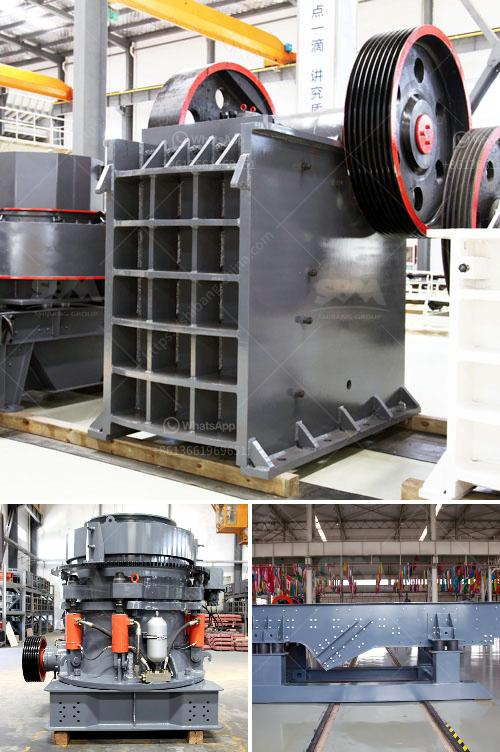

<h3>wet wet grinding mills</h3>
Wet grinding mills, also known as wet milling or wet grinding machines, are equipment used in various industries such as mining, metallurgy, cement, and chemicals for grinding, blending, and mixing materials. These mills are designed to break down materials into a colloidal suspension or slurry, enabling homogeneous and fine particle size distribution.

One of the key advantages of wet grinding mills is their ability to handle high moisture and viscosity materials that would otherwise clog or stick in dry grinding mills. The presence of water or other liquids in the mill aids in reducing friction and heat generation during the grinding process, preventing the material from overheating and maintaining its integrity.

The operation of wet grinding mills involves several stages. The material to be ground is fed into the mill along with liquid additives, such as water or solvents. The mixture is then subjected to grinding media, such as balls, pebbles, or rods, which impact and shear the material, resulting in size reduction. The finely ground material is discharged as a slurry through a screen or perforated plate, while the liquid component is recirculated for further processing.

One of the main applications of wet grinding mills is in the mineral processing industry. These mills are used for grinding ores and minerals to liberate valuable minerals from gangue materials. The wet grinding process enables better liberation of minerals, leading to improved recovery rates and higher concentrate grades.

The cement industry also relies on wet grinding mills for the production of cement slurries. These slurries are used for the manufacture of cementitious materials, such as Portland cement and blended cements. Wet grinding mills enable efficient grinding and mixing of raw materials, ensuring homogeneity and uniformity in the final cement product.

Wet grinding mills are also used in the chemical industry for the production of various chemical slurries and suspensions. These mills facilitate particle size reduction and blend different chemicals for manufacturing paints, pigments, dyes, and other chemical products.

Advancements in wet grinding mills have led to the development of more efficient and durable equipment. High-quality materials, such as stainless steel or ceramic, are used for construction, ensuring resistance to corrosion and wear. Enhanced cooling systems and monitoring devices help control the temperature and prevent overheating of the material during grinding.

In conclusion, wet grinding mills play a crucial role in various industries where fine particle size reduction and material blending are required. Their ability to handle high moisture and viscosity materials sets them apart from dry grinding mills, making them an essential tool in mineral processing, cement manufacturing, and chemical production. The continuous advancements in wet grinding mill technology improve their efficiency, reliability, and overall performance, further driving their adoption in diverse applications.
<h3>Contact us</h3><ul><li><strong>Whatsapp:&nbsp;<a href="https://wa.me/8613661969651">+8613661969651</a></strong></li><li><a href="https://swt.shibang-china.com/?git&amp;zhl&amp;wet wet grinding mills"><strong>Online Service(chat now)</strong></a></li></ul><h3>Related</h3><ul><li><a href='cone crushers to rent south africa.md'>cone crushers to rent south africa</a></li><li><a href='working of hydraulic circuit for milling machine.md'>working of hydraulic circuit for milling machine</a></li><li><a href='limestone crushing machines.md'>limestone crushing machines</a></li><li><a href='pulverizer for carbon black.md'>pulverizer for carbon black</a></li><li><a href='gold mining production line or gold mining plant.md'>gold mining production line or gold mining plant</a></li></ul>