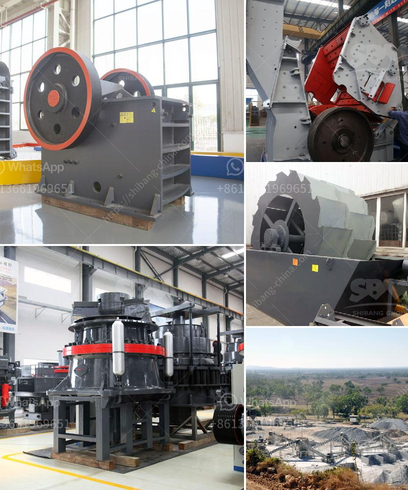

<h3>working of hydraulic circuit for milling machine</h3>
The hydraulic circuit for a milling machine is a complex system that utilizes pressurized hydraulic fluid to power and control the various movements of the milling machine's cutting tool. Unlike traditional mechanical milling machines that use gears and belts to transfer power, the hydraulic circuit powers the tool through pressurized fluid, making it more efficient and reliable.

The primary component of the hydraulic circuit for a milling machine is the hydraulic pump. It is responsible for generating and maintaining the required pressure of the hydraulic fluid, typically oil. The pump draws the oil from a reservoir and pressurizes it before sending it to the other components of the circuit.

The hydraulic circuit also consists of various valves that control the flow and direction of the hydraulic fluid. These valves are actuated by electrical or mechanical signals, allowing for precise control of the milling machine's movements. One of the essential valves in the circuit is the direction control valve. This valve directs the flow of fluid to the desired actuator, such as the hydraulic cylinder or motor, to move the cutting tool in a specific direction.

The hydraulic cylinder is another critical component of the circuit. It converts the hydraulic pressure into linear motion and is responsible for moving the milling machine's cutting tool. When the hydraulic fluid is directed to the cylinder, it pushes the piston, which in turn moves the associated mechanical components of the machine.

In addition to the hydraulic cylinder, there may also be hydraulic motors in the circuit. These motors convert the hydraulic pressure into rotary motion, allowing for the rotation of the milling machine's spindle or other components. The rotation of the spindle determines the speed and direction of the milling machine's cutting action.

To ensure efficient operation, the hydraulic circuit also includes a range of filters, coolers, and accumulators. Filters are used to remove any contaminants from the hydraulic fluid, preventing damage to the components. Coolers help dissipate the heat generated by the hydraulic system, ensuring stable performance. Accumulators store excess hydraulic fluid under pressure, providing additional power during peak demands and absorbing shocks to protect the system.

Overall, the hydraulic circuit for a milling machine enables precise control of its movements and provides the necessary power to cut through various materials. The use of hydraulic fluid as a power source offers numerous advantages over traditional mechanical systems, including increased efficiency, reduced maintenance, and improved overall performance.

In conclusion, the hydraulic circuit for a milling machine is a sophisticated system that combines pressure, valves, cylinders, and motors to power and control the tool's movements. It utilizes hydraulic fluid to generate the necessary force, allowing for precise and efficient milling operations. With its numerous advantages and reliability, the hydraulic circuit is an integral part of modern milling machines.
<h3>Contact us</h3><ul><li><strong>Whatsapp:&nbsp;<a href="https://wa.me/8613661969651">+8613661969651</a></strong></li><li><a href="https://swt.shibang-china.com/?git&amp;zhl&amp;working of hydraulic circuit for milling machine"><strong>Online Service(chat now)</strong></a></li></ul><h3>Related</h3><ul><li><a href='rencana anggaran biaya stone crusher.md'>rencana anggaran biaya stone crusher</a></li><li><a href='stone crushing plant business plan.md'>stone crushing plant business plan</a></li><li><a href='stone crusher plant made in pakistan price.md'>stone crusher plant made in pakistan price</a></li><li><a href='ballast ore crusher for sale in kenya.md'>ballast ore crusher for sale in kenya</a></li><li><a href='fine cone crusher.md'>fine cone crusher</a></li></ul>