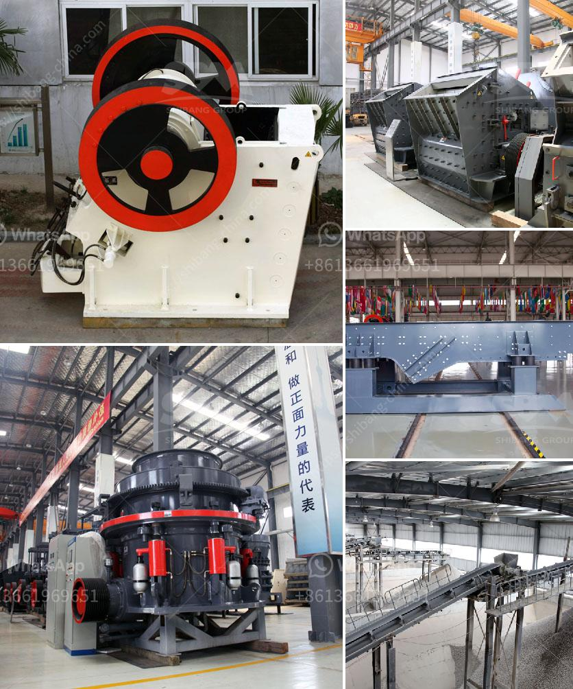

<h3>working of jaw crusher</h3>
A jaw crusher is a device that reduces the size of various solid materials in many applications, including underground mining and mobile crushing applications mainly using the compressive force of the two jaws, one of which is stationary and the other is moving. The working principle of jaw crushers is based on the reciprocating movement of the movable jaw that compresses and crushes the rock or ore between itself and the fixed jaw, as the material enters the zone between the jaws.

The moving jaw moves back and forth against the fixed jaw, and material fed from the top of the machine is compressed between the two, breaking it into smaller pieces. As the moving jaw moves away from the fixed jaw, the crushed material is discharged from the lower outlet of the crushing chamber. With the continuous rotation of the motor, the crushing process is continuously carried out, and the materials are periodically crushed and discharged until they meet the size requirements.

The design of the jaw crusher is simple, and its operation is reliable. The maintenance of jaw crusher is also very easy and convenient. The primary crushing process is generally conducted through the separate machines of each stage, which are called primary crusher, secondary crusher, and tertiary crusher. The primary crusher reduces large chunks of raw material into smaller pieces, and then further reduces it to the desired size. The final size of the crushed material depends on the gap between the jaws, the size of the feed material, and the rotational speed of the crusher.

During the crushing process, the jaws exert a compressive force on the material, gradually crushing it against the fixed jaw. This force is generated by the eccentric shaft, which is connected to the swing jaw. The movement of the swing jaw creates an angle between the fixed jaw and the moving jaw known as the throw. The size of this angle determines the maximum capacity of the crusher, and it also affects the wear of the machine's wear parts.

In addition to compression, jaw crushers can also apply shear and attrition forces to the material. As the material is crushed between the jaws, it is initially subjected to compression and eventually breaks due to the applied shear and attrition forces. The resulting particles are smaller and generally more angular in shape compared to those produced by other crushing mechanisms.

Jaw crushers are commonly used in the mining and aggregate industries for the primary crushing of various materials, including hard rock and ores. These machines are versatile and can be used for various stages of material reduction, from primary crushing to secondary and tertiary crushing. They are also used in recycling processes, such as the recycling of construction and demolition waste.

Overall, the working principle of a jaw crusher is straightforward and simple. It involves the movement of two jaws, one stationary and one movable, which creates a compressive force to crush the material. Jaw crushers are widely used in various industries, including mining, construction, and recycling due to their high efficiency and low maintenance requirements.
<h3>Contact us</h3><ul><li><strong>Whatsapp:&nbsp;<a href="https://wa.me/8613661969651">+8613661969651</a></strong></li><li><a href="https://swt.shibang-china.com/?git&amp;zhl&amp;working of jaw crusher"><strong>Online Service(chat now)</strong></a></li></ul><h3>Related</h3><ul><li><a href='manufacturing of talcum powder.md'>manufacturing of talcum powder</a></li><li><a href='indonesia roll crushers.md'>indonesia roll crushers</a></li><li><a href='rencana bisnis perusahaan tambang pdf.md'>rencana bisnis perusahaan tambang pdf</a></li><li><a href='mini stone crusher for sale.md'>mini stone crusher for sale</a></li><li><a href='used stone crusher equipment price uk.md'>used stone crusher equipment price uk</a></li></ul>