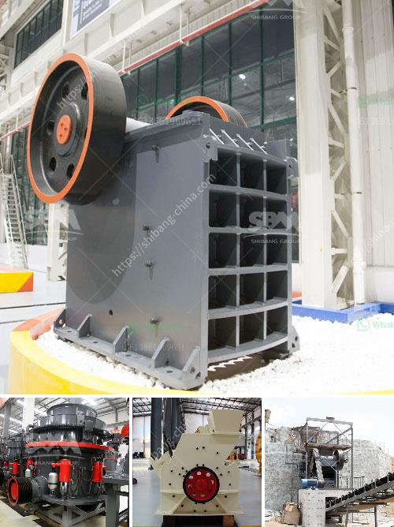

<h3>zambia mining conveyor belt</h3>
Zambia, a landlocked country in Southern Africa, has a rich history of mining. In recent years, the mining industry has been a major contributor to the country's economic growth, with copper being the key mineral extracted. Zambia's mining sector has relied heavily on the use of conveyor belts to transport the extracted copper ore from the mines to the processing plants.

There are several challenges faced by the mining industry in Zambia, one of which is the transportation of minerals across long distances. Traditional means of transportation, such as trucks, are not always feasible due to the rough terrain and long distances involved. This is where the mining conveyor belt comes into play.

A conveyor belt is a continuous loop of material that is often made of rubber or fabric. It allows for the efficient and safe transportation of materials from one location to another. In the case of the Zambian mining industry, conveyor belts are used to transport copper ore from underground mines to the surface for processing.

One of the benefits of using conveyor belts in the mining industry is their ability to handle a wide range of capacities, from a few tons per hour to thousands of tons per hour. This flexibility makes them ideal for handling the high volumes of copper ore produced in Zambia.

Additionally, conveyor belts are highly reliable and require minimal maintenance. This reduces downtime and increases the overall productivity of the mining operations. Furthermore, conveyor belts can be equipped with various accessories, such as metal detectors or dust control systems, to enhance safety and efficiency.

However, it is essential to ensure that the conveyor belts used in the mining industry are of high quality and can withstand the harsh conditions of the Zambian mines. Factors such as abrasion, heat, and moisture can degrade the integrity of the conveyor belts over time. Therefore, regular inspections and maintenance are crucial to ensure their longevity.

In conclusion, conveyor belts play a vital role in the mining industry in Zambia. They enable the efficient and safe transportation of copper ore from the mines to the processing plants, contributing to the country's economic growth. However, it is imperative to invest in high-quality conveyor belts and regularly maintain them to ensure their optimal performance.
<h3>Contact us</h3><ul><li><strong>Whatsapp:&nbsp;<a href="https://wa.me/8613661969651">+8613661969651</a></strong></li><li><a href="https://swt.shibang-china.com/?git&amp;zhl&amp;zambia mining conveyor belt"><strong>Online Service(chat now)</strong></a></li></ul><h3>Related</h3><ul><li><a href='mobile stone crushers for sale south africa.md'>mobile stone crushers for sale south africa</a></li><li><a href='processing of platinum ore flow sheet.md'>processing of platinum ore flow sheet</a></li><li><a href='mini stone crusher for sale.md'>mini stone crusher for sale</a></li><li><a href='pulverized ball mills.md'>pulverized ball mills</a></li><li><a href='laboratory grinding mills jaw crushers.md'>laboratory grinding mills jaw crushers</a></li></ul>