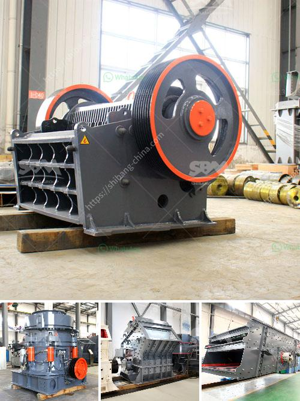

<h3>zircon sand supplier in singapore</h3>
When it comes to sourcing essential materials for industrial applications, Singapore has become a hub for high-quality suppliers. One such crucial material is zircon sand, known for its versatile applications in various industries. 

Zircon sand is primarily used in the manufacture of ceramics, refractories, and foundry molds due to its excellent heat resistance and stability. The demand for this resource has been steadily increasing, leading to the emergence of reliable suppliers in Singapore to meet industry needs.

Singapore-based zircon sand suppliers focus on delivering high-quality products that adhere to strict industry standards. They source zircon sand from reputable mines globally, ensuring that the sand is of superior quality. These suppliers employ stringent quality control measures, such as sample testing and analysis, to maintain consistency. The zircon sand undergoes thorough processing to eliminate impurities and achieve the desired specifications required by end-users.

Reliability is a crucial factor in the manufacturing sector, and zircon sand suppliers in Singapore understand this. They prioritize consistent product availability, ensuring that customers receive their orders promptly. By maintaining sufficient stock levels, these suppliers can cater to varying demand volumes, preventing production delays for their clients.

In addition to quality and reliability, zircon sand suppliers in Singapore prioritize customer satisfaction. They offer excellent customer service, addressing inquiries and concerns promptly and effectively. Transparent pricing and flexible payment options are also provided, creating a seamless purchasing experience for clients.

Moreover, zircon sand suppliers in Singapore embrace sustainable practices throughout their operations. They ensure the responsible sourcing of raw materials, adhering to environmental regulations. By partnering with these suppliers, businesses can contribute to sustainable manufacturing practices and promote a greener future.

In conclusion, the zircon sand supplier industry in Singapore plays a crucial role in meeting the growing demand for this essential material. These suppliers prioritize quality, reliability, and customer satisfaction, positioning themselves as trusted partners for businesses in various industries. With their commitment to sustainability, zircon sand suppliers in Singapore are paving the way for a more environmentally conscious manufacturing sector.
<h3>Contact us</h3><ul><li><strong>Whatsapp:&nbsp;<a href="https://wa.me/8613661969651">+8613661969651</a></strong></li><li><a href="https://swt.shibang-china.com/?git&amp;zhl&amp;zircon sand supplier in singapore"><strong>Online Service(chat now)</strong></a></li></ul><h3>Related</h3><ul><li><a href='europe quartz stone machinery factory.md'>europe quartz stone machinery factory</a></li><li><a href='clay crusher processing in india.md'>clay crusher processing in india</a></li><li><a href='advantage of wet grinding in cement manufacturing.md'>advantage of wet grinding in cement manufacturing</a></li><li><a href='calcium carbonate grinding plant feasibility.md'>calcium carbonate grinding plant feasibility</a></li><li><a href='fly ash grinding machine manufacturer.md'>fly ash grinding machine manufacturer</a></li></ul>